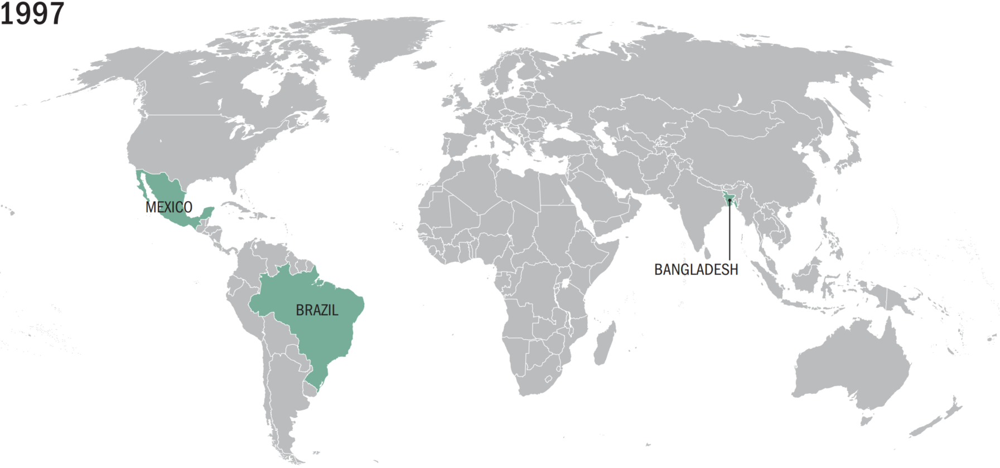
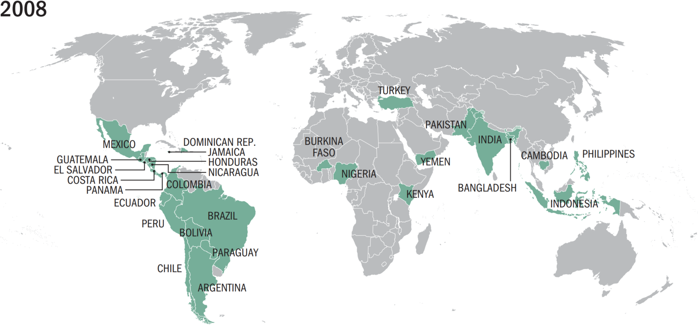
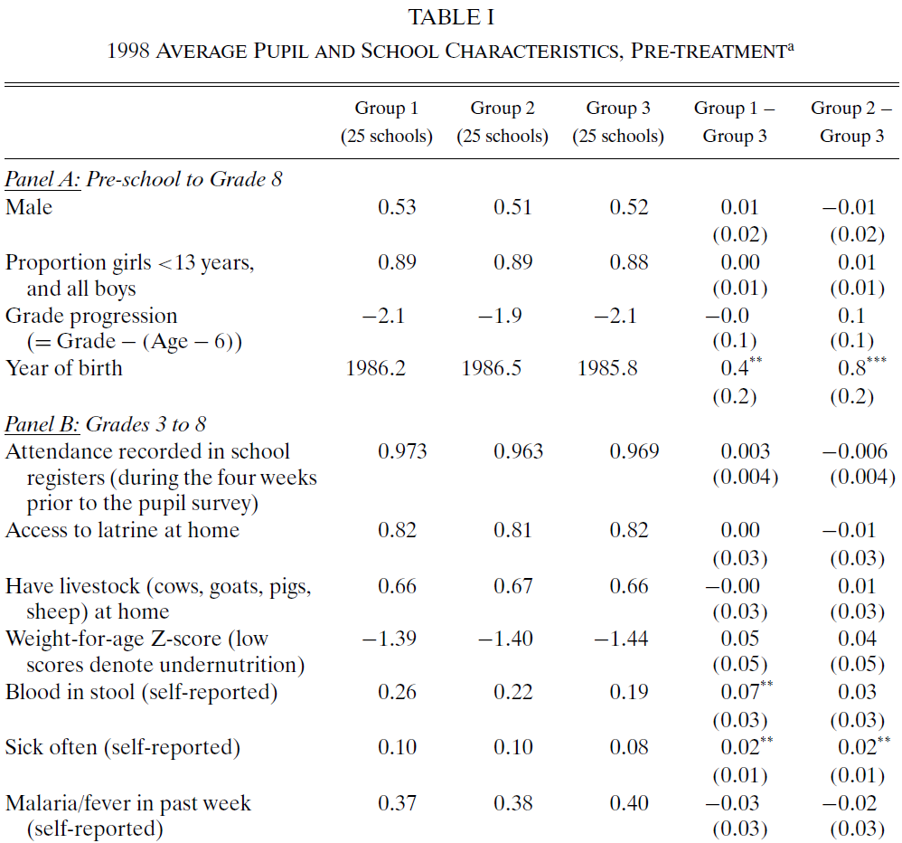
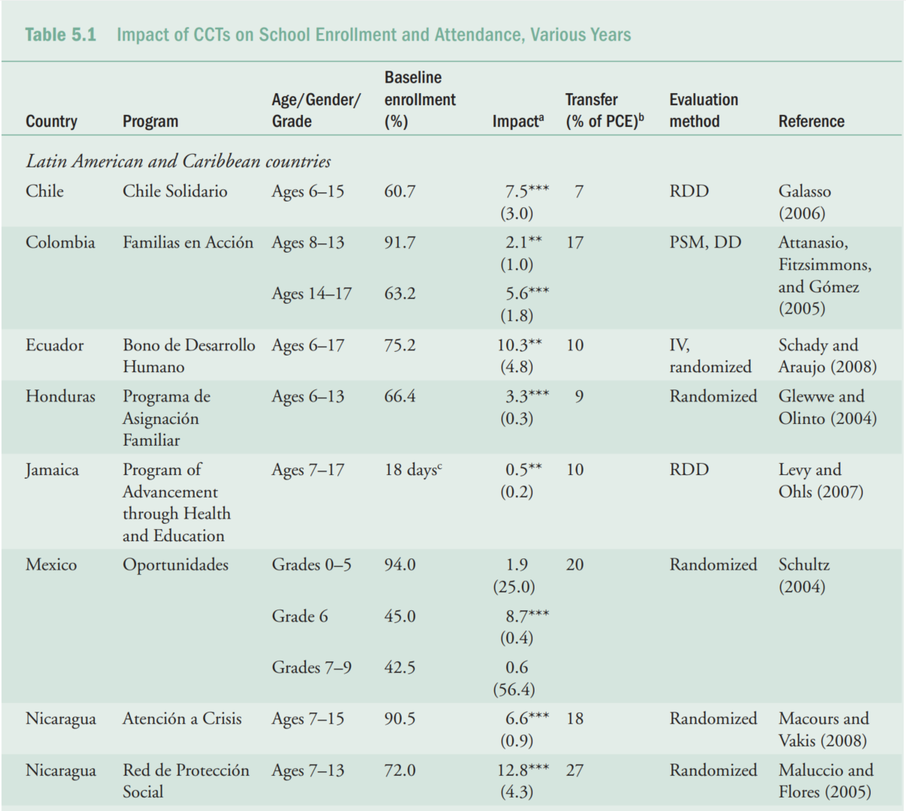
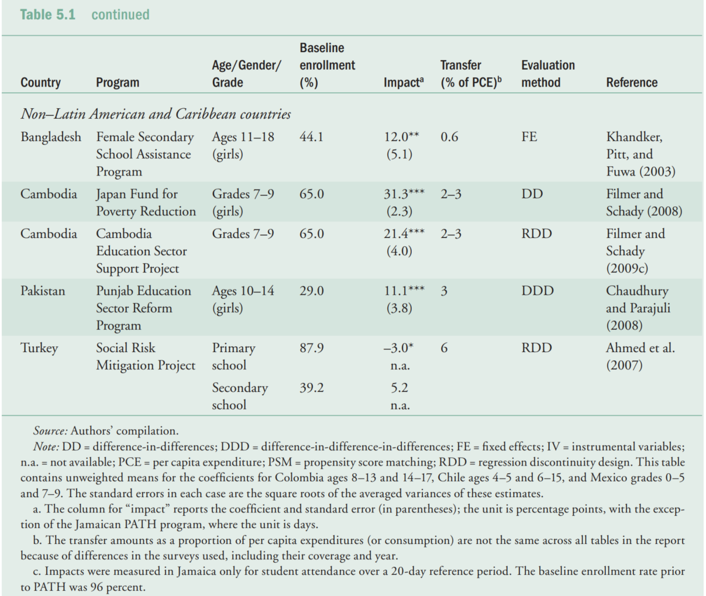

```{r}
#| include: false
# source(here::here("materials", "00-setup.R"), local = TRUE)
knitr::opts_chunk$set(fig.width = 8)
knitr::opts_chunk$set(fig.height = 4.5)
```

# t-test with the Conditional Cash Transfers (CCTs)

Let us consider an example of CONDITIONAL CASH TRANSFERS' causal effect on children school enrollment.

> See: CH 5. The Impact of CCT Programs on the Accumulation of Human Capital from [@Fiszbein2009].

## Conditional Cash Transfers (CCTs) {.smaller}

CCTs are programs that **transfer cash** on the **condition of making pre-specified investments** in **human capital and children**. [@Fiszbein2009, Figure 1]

::: r-stack
::: fragment

:::

::: fragment

:::
:::

::: footer
:::

## Cause and Effect

::: fragment
### 1. Cause / Treatment:

::: incremental
-   CCTs (monetary incentive) + Pre-specified conditions
:::
:::

::: columns
::: {.column width="50%"}
::: fragment
### 2.a Outcome / Factual

::: incremental
-   School enrollment
-   in treatment;
:::
:::
:::

::: {.column width="50%"}
::: fragment
### 2.b Counterfactual

::: incremental
-   School enrollment
-   in control;
:::
:::
:::
:::

::: fragment
### 3. ATE: $\text{Effect} = \text{Factual} - \text{Counterfactual}$

::: incremental
-   $\text{Average Treatment Effect} = \text{Enrollment Rate Difference}$
:::
:::

## What makes "Difference in Enrollment Rate" a causal effect?

> What statistical concepts ensure that the difference in school enrollment between the treatment and control is caused by the treatment?

::: incremental
1.  Research Designed with the RCT:

    -   Randomization between the Control and Treatment group;

2.  **the Law of Large Numbers** (LLN):

    -   Both random groups are equal on average;

3.  The RCT + LLN = **Ceteris Paribus**;

    -   All other things are equal between the Control and Treatment groups;
:::

## Good controls in the RCT

The control group is a perfect **counterfactual** when **three conditions are met**:

::: incremental
1.  has the same characteristics, on average, as the treatment group;

2.  remains unaffected by the treatment; and

3.  reacts to the treatment in the same way as the treatment group;
:::

::: fragment
> When these three conditions are met, the treatment causes the effect ceteris paribus [@Gertler2016].
:::

::: notes
1.  the average characteristics of the treatment group and the comparison group must be identical in the absence of the program.2 Although individual units in the treatment group don't need to have "perfect clones" in the comparison group, on average the characteristics of treatment and comparison groups should be the same.

2.  treatment should not affect the comparison group either directly or indirectly.

3.  the outcomes of units in the control group should change the same way as outcomes in the treatment group if both groups were given the program (or not).
:::

## How to check that ceteris paribus is ensured?

> What statistical tools are used to check that control and treatment groups are the same on average?

::: incremental
-   Checks and balance tables

    -   performs a mean-difference test between treatment and control for
    
    -   variables that are (should be) independent of treatment

-   No significant differences (failing to reject $H_0$) suggest that the two groups are the same on average

-   Any significant differences (rejecting $H_0$ at the $\alpha$ level of significance) imply that the two groups are not random.
:::

## Ceteris Paribus

Other things are equal! The "other things" are:

::: incremental
-   **measurable features** (age, height, costs, ...);

-   **measurable but absent from our data**;

-   **nonmeasurable factors** (ability, effort, connections, ...)
:::

## Checks and balances table {.smaller}

::::: columns
::: {.column width="35%"}
Source: [@Miguel2004] table 1.

Variable-specific means are not the same across groups.

-   How to conclude about any difference?

Note: `***` indicates p-value < 0.01, `**` p-value < 0.05, and `*` p-value < 0.1. 
:::

::: {.column width="65%"}
{fig-align="center"}
:::
:::::

## Hypothesis testing

Formulate $H_0$ and $H_1$. 

::: fragment
-   $H_0: \text{diff} = 0$

-   $H_1: \text{diff} \ne 0$
:::

::: fragment
Use a statistical test, called **t-test**

-   to conclude weather to reject $H_0$ or fail to reject $H_0$.
:::

## t-tests (1) {.smaller}

Is a statistical test use to conclude about the population based on a sample.

1.  One sample t-test: Compares a population parameter $\mu$ to an arbitrary number?

2.  Two sample t-test: Compares difference between two parameters $\mu_1$ and $\mu_2$ in the population?

**Its purpose is to infer:**

::: incremental
-   whether or not the population parameter $\mu$ (mean, or else)

-   is different from an arbitrary number (usually zero: $\mu_{0} = 0$)

-   based on our sample estimates of

    -   the parameter ($\widehat{\text{mean}}$), its variance ($s$), and the sample size $n$.
:::


## t-tests (2) Alhorithm 1/2 {.smaller}

Step 1: Formulate our **Hypotheses**

::: fragment
::: columns
::: {.column width="30%"}
$H_0: \mu = 0$
:::

::: {.column width="70%"}
$H_1: \mu \ne 0$
:::
:::
:::

::: fragment
Step 2: Compute out **Statistics** based on the sample

-   Estimated parameter: $\widehat{\mu}$

-   Standard Deviation: $s$

-   Zero hypothesis value: $\mu_0 = 0$

-   Significance level: $\alpha = 0.05$

-   Number of observations: $n$
:::


## t-tests (3) Alhorithm 2/2 {.smaller}

Step 3: Compute **t-statistics** (and a **p-value** using the PC)

::: fragment

$$
t =  \frac{\hat\mu - \mu_0}{\text{se}} =  \frac{\sqrt{n} ( \hat\mu - \mu_0)}{s}\,,
$$

where $se = s / \sqrt{n}$ is the standard error of the estimate;
:::

::: fragment
Step 4: **Conclude**

::: incremental
1.  Reject $H_0$ if:

    -   $|t| > 2$ the "rule of thumb" 
    
        -   The same applies if we say that the estimate is two times larger than the mean.
    
    -   $\text{p-value} < \alpha$ (probability of type I error \< level of significance

2.  Fail to reject $H_0$
:::
:::

## Checks and balances: conclusions 

::: columns
::: {.column width="35%"}

Are the treatment and control groups on average similar?

Table source: [@Miguel2004].

Note: `***` indicates p-value < 0.01, `**` p-value < 0.05, and `*` p-value < 0.1. 

If yes: [A mean comparison of the outcome variables reveals the causal effect]{.fragment}

If no: [We need to use other methods to measure the effect, such as regression.]{.fragment}
:::

::: {.column width="65%"}
{fig-align="center"}
:::
:::

## t-tests (3.1) example {.smaller}

**Do the CCTs improve children school enrollment?** [@Fiszbein2009]

::: incremental
-   The effect: [$\widehat{\text{Enrollment change}} = \widehat{\text{After the CCT}} - \widehat{\text{Before the CCT}}$]{.fragment}

-   Hypothesis:

    -   $H_0:$ [$\text{Enrollment change} = 0$]{.fragment}

    -   $H_1:$ [$\text{Enrollment change} > 0$]{.fragment}

-   Statistical test:

    -   [One-sided t-test]{.fragment}
    
    -   [at the 5% level of significance $\alpha = 0.05$]{.fragment}

-   **Desired t-test result:**

    -   Which t-test result indicates that CCT has a positive effect on school enrollment?

    -   $\text{p-value}$ [$< \alpha$ or $\text{p-value} < 0.05$]{.fragment}

    -   $|\text{t-statistics}|$ [$> c_{df, \, 0.95}$]{.fragment}

    -   We need to be able to reject $H_0$
:::

::: footer
Source: [@Fiszbein2009]
:::

## t-tests (3.2) example {.smaller}

::: columns
::: {.column width="60%"}

:::

::: {.column width="40%"}
-   The column for "impact" reports the difference and standard error (in parentheses); the unit is percentage points, except of the Jamaican PATH program.

-   `*`, `**`, and `***` indicates if the p-value is below a corresponding significance levels of 10, 5, and 1 percent.

::: incremental
-   What is shown in the rows?
    -   [case-specific t-test]{.fragment}
-   What are $H_0$ and $H_1$?
    -   [$H_0: \text{diff} = 0$; $H_1: \text{diff} \ne 0$;]{.fragment}
-   What are the conclusions for each row?
    -   [Reject/Accept $H_0$]{.fragment}
-   What do "stars" imply for test-specific conclusions for each row?
:::
:::
:::

## t-tests (3.3) example {.smaller}

::: columns
::: {.column width="40%"}

:::

::: {.column width="60%"}
Interpret results of the statistical test for country A at the X (1%, 5%) level of significance.

-   State Null and Alternative hypotheses.
-   Conclude about the HT results.
-   What parameter/statistics/number was used to make this conclusion?

For example. In (Ahmed et al. 2007) authors failed to show that CCTs improve/worsen children school enrollment in Turkey. With "H0: no improvement" versus the "H1: some improvement", the authors failed to reject the H0 at the 5% sign. level for the populations of primary and secondary school attendees ...

:::
:::

(For example cont.) ... In absolute terms, authors show a reduction in primary school enrollment by 3% and an increase in secondary school enrollment by 5.2%. However, the probability that these changes are due to sample variation (probability of type I error / p-value) is above 5% and 10% respectively. Table source: [@Fiszbein2009]

## Homework: Read/do more on Hypothesis testing

[OpenIntro](https://www.openintro.org/book/os/) Foundations for Inference:

-   [Point Estimates](https://youtu.be/oLW_uzkPZGA)
-   [Hypothesis Testing Fundamentals](https://youtu.be/NVbPE1_Cbx8)
-   [Inference for Estimators Other Than the Mean](https://youtu.be/PUMBNtVKr_g)

Khan Academy:

-   [The idea of significance tests](https://www.khanacademy.org/math/statistics-probability/significance-tests-one-sample/idea-of-significance-tests/v/simple-hypothesis-testing)
