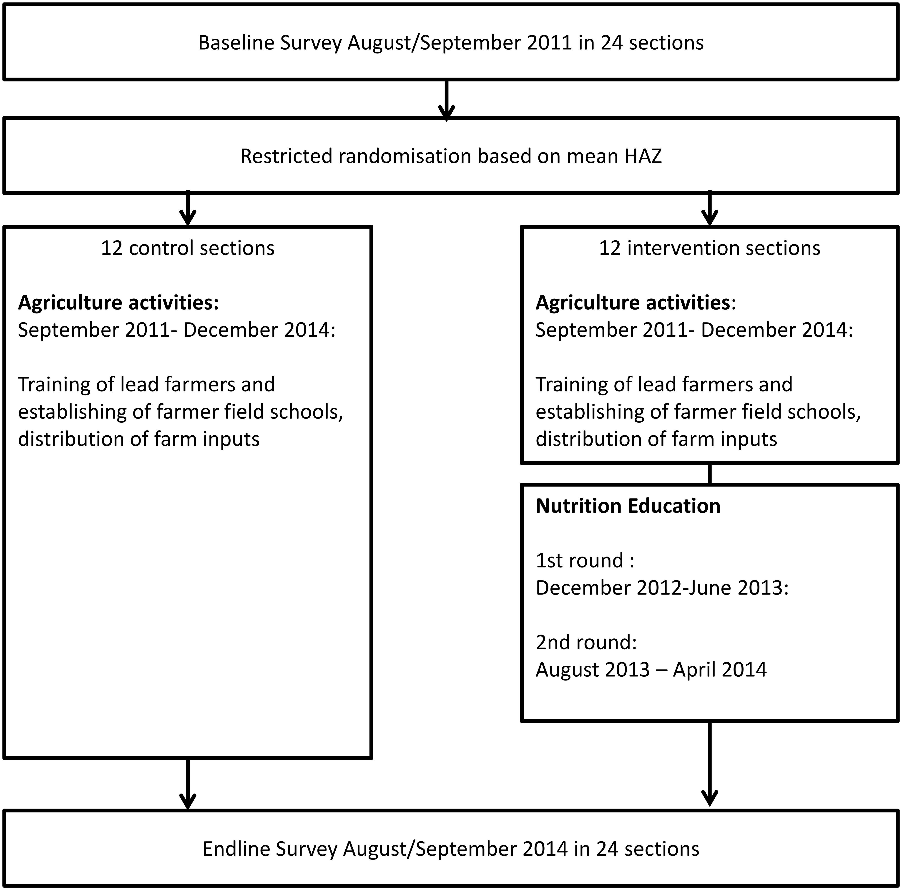
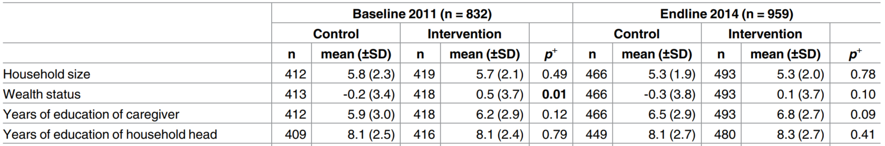
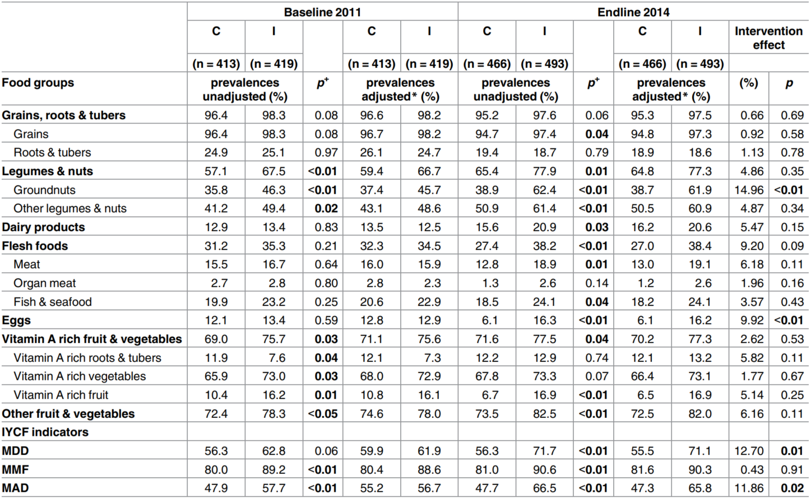

# Hypothesis testing

A statistical hypothesis test is a **method of statistical inference** used to decide **whether the data** at hand **sufficiently supports a particular hypothesis**.

::: fragment
> Hypothesis testing **allows us to make probabilistic statements about population parameters**.

-   Read more in Appendix C-6 in [@wooldridge2020introductory].
:::

::: footer
Source: [the wiki](https://en.wikipedia.org/wiki/Statistical_hypothesis_testing)
:::

## Hypothesis testing

::: fragment
### What?

::: incremental
-   Hypothesis Test: A statistical test of the **null hypothesis** against an **alternative hypothesis** [@wooldridge2020introductory].
:::
:::

::: fragment
### Why?

::: incremental
-   We never know the true parameters of the population.
-   We must infer about the population from samples.
-   HT establishes certainty behind our inference (probability or an error).
:::
:::

::: fragment
### How?

::: incremental
-   Following Neyman-Pearson's [@Neyman1933] approach to hypothesis testing.
:::
:::

## Neyman-Pearson's approach

::: incremental
-   Assumes that an **infinite number of repeated samples** can be drawn from the same population.

-   Aims to **minimize the risk of making false conclusions** about the relationship.

-   Controls the probability of error when stating, "**we reject** the **null hypothesis**."
:::

## Hypothesis Testing: Steps

::: columns
::: {.column width="50%"}
::: incremental
1.  $H_0$: Null/Zero Hypothesis;

    -   $H_0 : \mu = 0$

2.  $H_1$: Alternative Hypothesis;

    -   $H_1 : \mu \ne 0$

3.  **Estimate parameters**:

    -   $\hat \mu = \widehat{\text{mean}}$ , and
    -   $s = \widehat{\text{SD}}$

4.  **Compute the test statistics**;

    -   usually $t$ statistics
:::
:::

::: {.column width="50%"}
::: incremental
5.  **Conclude:**

    -   **to reject** $H_0 = \text{accept}\, H_1$, or

    -   **fail to reject** $H_0 = \text{accept}\, H_0$

6.  **Calculate probabilities** of making an error.

    -   probability value (aka "p-value")
:::
:::
:::

## Hypothesis Testing may result in two errors

::: columns
::: {.column width="50%"}
::: fragment
### Type I error

-   false positive

-   probability value: "p-value"
:::
:::

::: {.column width="50%"}
::: fragment
### Type II error

-   false negative
:::
:::
:::

::: columns
::: {.column width="50%"}
::: fragment
The error of rejecting $H_0$, when $H_0$ is the `TRUE` hypothesis
:::
:::

::: {.column width="50%"}
::: fragment
The error of accepting $H_0$, when $H_0$ is the `FALSE` hypothesis

::: fragment
::: callout-important
#### NEVER KNOWN to the researchers!
:::
:::
:::
:::
:::

## `p-value` probability value

::: incremental
Neyman-Pearson's approach to HT suggests:

-   reject $H_0$, when

-   p-value (probability of the **Type I error**)

-   is below [the **level of significance** $\alpha$]{style="color: red;"}.
:::

::: fragment
That means:

-   when we reject $H_0$, the probability that we've made a mistake is below $\alpha$
:::

::: fragment
Thus, [**we reject** $H_0$ **only and only if** $\text{p-value} < \alpha$]{style="color: red;"}.
:::

## $\alpha$ is the level of significance

-   Maximum probability of a Type I error in hypothesis testing.

-   In social sciences, the level of significance 

    -   should not be higher than 5% ($\alpha = 0.05$).
    
    -   $\alpha = 0.01$, $\alpha = 0.001$ are allowed.

# HT Examples

## Example (1): Stunting and education

Can educating and training parents about nutrition reduce stunting in children?

::: fragment
Our data measures the change in stunting levels before and after training for 500 individuals.
:::

::: fragment
-   Formulate the hypotheses: $H_0$ and $H_1$.

-   Provide examples of Type I and Type II errors in the context of your hypothesis.
:::

## Hypotheses examples

Null hypothesis: 

::: fragment
-   $H_0:{\Delta}_{\text{stunting}} = 0$
:::

Alternative hypothesis: 

::: fragment

-   $H_1:{\Delta}_{\text{stunting}} \ne 0$ 

:::

::: fragment
-   $H_1:{\Delta}_{\text{stunting}} > 0$
:::

::: fragment
-   $H_1:{\Delta}_{\text{stunting}} < 0$
:::

## Errors examples

**Type I error:**

::: fragment
1/4   We conclude **to reject** $H_0$: ${\Delta}_{\text{stunting}}\ne 0$,

2/4   But this conclusion is driven **by a random variation in the sample**.
:::

::: fragment
3/4   In the population, training had nothing to do with stunting.
:::

::: fragment
4/4   Repeated sampling will probably fail to show a difference.
:::

**Type II error:**

::: fragment
1/3   We conclude **to accept** $H_0$: stunting rate did not change after training.
:::

::: fragment
2/3   In fact, the Training helped, but... 
:::

::: fragment
3/3   other factors let to the food shortage in the survey year.
:::

## Example (2)

### Question: What % of ravens are White?

::: columns
::: {.column width="70%"}
::: fragment
[Hypothesis:]{style="color: blue;"}

::: incremental
-   $H_0:$ White ravens make up 0% of the population
-   $H_1:$ Share of white raven is not zero (\> 0%)
:::
:::
:::

::: {.column width="30%"}
::: fragment
[Data:]{style="color: green;"}

::: incremental
-   we went to a park;
-   we saw 100 ravens (or crows);
-   **no white ravens**!
:::
:::
:::
:::

::: fragment
**Results: the share of white ravens is 0!**
:::

::: fragment
[Conclusion: **fail to reject** $H_0$ (**Accept** $H_0$ )]{style="color: red;"}
:::

::: notes
Was this a random sampling?
:::

## Example (2): Raven color

### [Conclusion: **Accept** $H_0$ (there are no white ravens)]{style="color: red;"}

::: fragment
Did we make any errors? If yes, which one?

::: incremental
-   We've made the **type II error: false negative**.
:::
:::

::: fragment
**Because:**

::: incremental
-   We do not know if $H_0$ is a true hypothesis.
-   We did not use theory (did not study ornithology).
-   [The theory has to justify our choice of the $H_0$.]{style="color: red;"}
:::
:::

::: fragment
{.absolute top="50" right="50" width="350"}
:::

::: footer
[Image source](https://vancouversun.com/news/local-news/rare-white-raven-spotted-on-vancouver-island)
:::

## Homework on hypothesis testing {.smaller}

::: columns
::: {.column width="50%"}
Be prepared to answer the following questions in response to a hypothetical research question prompt during an exam.

1.    What is the outcome variable and what is the treatment? Describe how you would measure those.

2.    Define the factual and counterfactual outcomes. 

3.    Formulate $H_0$ and $H_1$.

4.    What plausible causal channel(s) runs directly from the treatment to the
outcome?

5.    Discuss Type I and Type II errors in the context of your hypothesis.

6.    Provide examples of factors that could lead to these errors.

7.    Propose an RCT experiment that could help answer these questions.

8.    Explain what makes an RCT a good/bad solution to the research question.    
:::

::: {.column width="50%"}

Research questions:

-   How does students' performance in a class vary across different years of enrollment?

-   Are yields higher on farms that use precision agriculture?

-   How effective are cash disbursements in alleviating poverty?

-   What is the poverty-reducing effect of schooling?

-    Many firms, particularly in southern European countries, are small, and owned and run by families. Are family owned firms growing more slowly than firms with a dispersed ownership?

-   What is the effect of studying economics rather than sociology on the salaries of university graduates?

-   What is the effect of mortgage interest rates on the number of new housing starts?
:::
:::

# Examples of Hypothesis Testing

The paper [@Kuchenbecker2017] aimed to assess the potential of community-based nutrition education to improve height-for-age z-scores in children aged 6 to 23 months.

-   The authors conducted a randomized controlled trial (RCT) in Malawi over 5 years.

-   Data were collected for both the control and treatment groups at baseline and at the end line.

Kuchenbecker, Judith, ... and Irmgard Jordan. 2017. “Nutrition Education Improves Dietary Diversity of Children 6-23 Months at Community-Level: Results from a Cluster Randomized Controlled Trial in Malawi.” Edited by Jacobus P. van Wouwe. PLOS ONE 12 (4): e0175216. <https://doi.org/10.1371/journal.pone.0175216>

## @Kuchenbecker2017: Research design

{fig-align="center"}

## @Kuchenbecker2017

::: incremental
-   If the paper finds a difference in nutrition statuses between the control and treatment groups, does it mean that education has a causal effect on nutrition?

    -   Yes! But...
    
    -   Only if the treatment and control groups are similar on average in (all) other factors.

    -   Such factors include income, education, household characteristics, skills, agricultural abilities, and so on...
:::

## Checks and balances

To identify that factors (age, education, ...) are **NOT DIFFERENT** between two groups, we need to:

::: incremental
-   Perform statistical hypothesis testing.

-   Formulate the hypotheses:

    -   $H_0$: Factor A in the treatment group is equal to that in the control group.
    -   $H_1$: Factor A in the treatment group is NOT equal to that in the control group.

-   Conclude:

    -   We fail to reject $H_0$.
    -   *This means there is no difference between the control and treatment groups.*
:::

## Checks and balances: the table

This table is essential for evaluating whether the treatment and control groups of the RCT are similar on average.

::: incremental
The table usually shows:

-   The estimated mean and standard deviation (SD) in the control and treatment groups.

-   The statistical test for the difference in means.

-   The probability value of the Type I error (p-value).
:::

## @Kuchenbecker2017: Checks and balances tables 2-3

{fig-align="center"}

Full [table 2](https://journals.plos.org/plosone/article/figure/image?size=large&id=10.1371/journal.pone.0175216.t002) and [table 3](https://journals.plos.org/plosone/article/figure/image?size=large&id=10.1371/journal.pone.0175216.t003)

::: fragment
-   Formulate H0 and H1 about **each variable** in the table.

-   Perform statistical HT about the mean difference between treatment and control groups..

-   Conclude if each variable **is the same** (**is different**) between the treatment and control groups.
:::

## Balance of the HH size

{fig-align="center"}

::: incremental
-   H0: Average household size is equal between Control and treatment;

    -   $H_0: \text{HH Size}_{\text{Control}} = \text{HH Size}_{\text{Treatment}}$

-   H0: Average HH size is unequal

    -   $H_1: \text{HH Size}_{\text{Control}} \ne \text{HH Size}_{\text{Treatment}}$

-   Probability of the type I error: 0.49 (p-value)

-   Fail to reject $H_0$. Because:

-   The difference between C and I is insignificant at the 5% level of significance.
:::

## Remember

The checks and balances table must indicate that **treatment and control groups are similar (=)** on average.

::: incremental
-   What if the treatment and control groups are not similar on average?

    -   Our outcome variable may also not be similar.
    
    -   However, this difference may be caused by factors other than the treatment.
    
    -   The true effect of the treatment could still be zero!
:::

## How to identify if the intervention helped?

Because @Kuchenbecker2017 is an RCT, we can:

::: incremental
-   Compare means of the outcome variable between two groups, by

-   Performing a statistical hypothesis testing (same as in checks and balances),

-   But now **we want to reject** (find a difference) the $H_0$ at the significance level $\alpha$
:::

## @Kuchenbecker2017 table 4: Intervention outcomes

{fig-align="center"}

##  Watch now:

[**How to Read Economics Research Papers: Randomized Controlled Trials (RCTs)**](https://youtu.be/s-_3s3OMeqs)

<https://youtu.be/s-_3s3OMeqs>

See [@Carter2017] that underpins the video.

## At home:

Practice:

-   Formulate H0 and H1.

-   Perform statistical hypothesis testing about the mean difference between treatment and control.

-   For each variable in

    -   Table 4 in  @Kuchenbecker2017.
    
    -   Table 1 in @Gertler2004
