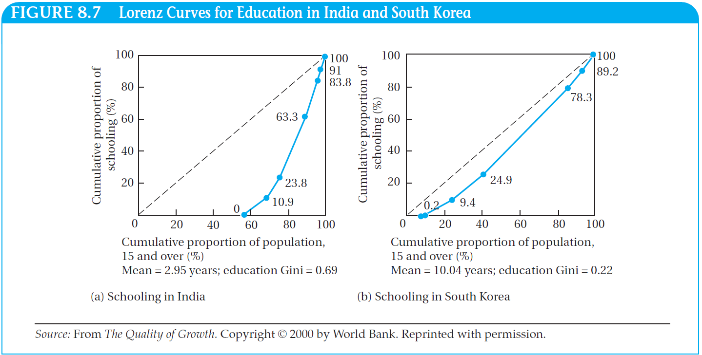

```{r}
#| include: false
source(here::here("materials", "00-setup.R"), local = TRUE)
knitr::opts_chunk$set(fig.width = 8)
knitr::opts_chunk$set(fig.height = 4.5)
```


```{r}
inc_dta <- 
  here("materials", "data", "income-distribution.rds") %>%  
  read_rds() %>%
  group_by(year, region) %>% 
  mutate(freq_total = sum(freq)) %>% 
  group_by(year, region, freq_total) %>% 
  mutate(dens = freq / freq_total) %>% 
  nest() %>% 
  mutate(
    model = map(data, ~{
      # browser()
      mod <- approxfun(x = .x$income, y = .x$dens)
      dta <- 
        tibble(income = c(seq(0, 150000, 25))) %>% 
        mutate(dens = mod(income)) %>% 
        replace_na(replace = list(dens = 0)) %>% 
        mutate(dens = dens / sum(dens)) 
      dta
      })
  ) %>% 
  unnest(model) %>% 
  mutate(freq = dens * freq_total)  %>% 
  ungroup() %>% 
  mutate(
    region = 
      ifelse(str_detect(region, "Russia"), "C.Asia Europe MENA", region),
    region = ifelse(str_detect(region, "Latin"), "LAC", region),
    region = region %>% 
      factor(levels = c("China", "India", "Other Asia", "LAC", 
                        "C.Asia Europe MENA", "Sub-Saharan Africa", 
                        "Developed Countries")))

inc_dist_0 <- 
  inc_dta %>% 
  filter(year == 1998, income > 0, freq > 0) %>% 
  ggplot() + 
  aes(x = income, weight = freq, fill = "All ocountries", colour = "All ocountries") + 
  scale_fill_viridis_d(begin = 0.5) +
  scale_color_viridis_d(begin = 0.5) +
  scale_y_continuous(
    n.breaks = 8, 
    labels = label_number(suffix = " B", scale = 1e-6)
    ) +
  scale_x_continuous(n.breaks = 10) + 
  theme(legend.position = "none") +
  ylab("Frequency") +
  xlab("Income/person/year in 2005 US$ adjusted to the PPP") +
  labs(title = "Global income distribution in 1998")

inc_dist_0a <- 
  inc_dist_0 %+%
  (
     inc_dta %>% 
       filter(year == 1998) %>% 
       group_by(year, income) %>% 
       summarise(freq = sum(freq, na.rm = T))
  )

# inc_dist_1a <- 
#   inc_dist_0 %+%
#   (
#      inc_dta %>% 
#        filter(year == 1998) %>% 
#        group_by(year, income) %>% 
#        summarise(freq = sum(freq, na.rm = T))
#   ) + 
#   geom_histogram(breaks =  10 ^ seq(1, 6, 0.1), alpha = 0.6) +
#   scale_x_continuous(
#     limits = c(50, 100000),
#     n.breaks = 10,
#     labels = label_number(big.mark = " ")
#   ) 

inc_dist_1 <- inc_dist_0 +
  geom_histogram(binwidth = 2000, alpha = 0.6)

inc_dist_2 <-
  inc_dist_0 + 
  geom_histogram(breaks =  10 ^ seq(1, 5, 0.1), alpha = 0.6) +
  scale_x_continuous(
    limits = c(50, 100000),
    breaks = 10 ^ (1:5) %>% c(., (.)/2) %>% sort(),
    trans = "log10", 
    labels = label_number(big.mark = " "), 
    minor_breaks =  c(
        seq(50, 100, 10),
        seq(100, 1000, 100),
        seq(1000, 10000, 1000),
        seq(10000, 100000, 10000)
      )
  ) +
  annotation_logticks(sides = "b")

inc_dist_2c <- 
  inc_dist_2 + 
  scale_x_continuous(
    limits = c(50, 100000),
    breaks = 10 ^ c(2:5) %>% c(., 10^ log10(50)) %>% sort(), trans = "log10",
    labels = label_math(10^.x)(c(1.699, 2:5)))
inc_dta_agg <- 
  inc_dta %>% 
  summarise(
    Mean = weighted.mean(income, freq),
    Median =  matrixStats::weightedMedian(income, freq)
  ) %>% 
  pivot_longer(everything()) 


inc_dist_1a <- 
  inc_dist_1 + 
  geom_vline(data = inc_dta_agg,
             mapping = aes(xintercept = value, 
                           linetype = name),
             size = 1) +
  theme(legend.position = c(.9,.9)) + 
  scale_linetype_manual(values = c(1,4)) +
  guides(colour = "none", fill = "none")

pg <- ggplot_build(inc_dist_2)

two_modes <- 
  pg$data[[1]] %>% 
  slice(c(20, 32)) %>% 
  mutate(lab = c("Mode 1", "Mode 2"))

inc_dist_2a <- 
  inc_dist_2 + 
  geom_label(
    data = two_modes %>% mutate(ymax),
    mapping = aes(x = 10^x, y = ymax*1.05, label = lab),
    inherit.aes = FALSE
  )

inc_dist_2b <- 
  inc_dist_2a + 
  geom_vline(data = inc_dta_agg,
             mapping = aes(xintercept = value, 
                           linetype = name),
             size = 1) +
  theme(legend.position = c(.9,.9)) + 
  scale_linetype_manual(values = c(1,4))+
  guides(colour = "none", fill = "none")
```

## Symmetric vs Non symmetric

::: columns
::: {.column width="50%"}
```{r}
#| fig-width: 6
tibble(x = rbeta(10000, 5, 5)) |> 
  ggplot() + aes(x = x) + 
  geom_histogram(aes(y = after_stat(density)), fill = "grey", colour = "black") + 
  geom_density(linewidth = 1) + theme_void() + 
  labs(title = "Symmetric distribution") + 
  geom_vline(aes(xintercept=mean(x)), linetype = 1, linewidth = 2, colour = "red")+ 
  geom_vline(aes(xintercept=median(x)), linetype = 2, linewidth = 2, colour = "blue")
```
:::
::: {.column width="50%"}
```{r}
#| fig-width: 6
a <- 
  tibble(x = rbeta(10000, 2, 50)) |> 
  ggplot() + aes(x = x) + 
  geom_histogram(aes(y = after_stat(density)), fill = "grey", colour = "black") + 
  geom_density(linewidth = 1) + theme_void() + 
  labs(title = "Right skewed (positive skewed)")+ 
  geom_vline(aes(xintercept=mean(x)), linetype = 1, linewidth = 2, colour = "red")+ 
  geom_vline(aes(xintercept=median(x)), linetype = 2, linewidth = 2, colour = "blue")
b <- 
  tibble(x = rbeta(10000, 50, 2)) |> 
  ggplot() + aes(x = x) + 
  geom_histogram(aes(y = after_stat(density)), fill = "grey", colour = "black") + 
  geom_density(linewidth = 1) + theme_void() + 
  labs(title = "Left skewed (negative skewed)")+ 
  geom_vline(aes(xintercept=mean(x)), linetype = 1, linewidth = 2, colour = "red")+ 
  geom_vline(aes(xintercept=median(x)), linetype = 2, linewidth = 2, colour = "blue")

a / b
```
:::
:::

## Extreem and influential observations

::: columns
::: {.column width="50%"}
```{r}
#| fig-width: 6
tibble(x = rbeta(10000, 5, 5), type ="Symmetric") |> 
  bind_rows(tibble(x = rbeta(10000, 2, 5), type ="Right skewed") ) |> 
  bind_rows(tibble(x = rbeta(10000, 5, 2), type ="Left skewed") ) |> 
  ggplot() + 
  aes(x = x, y = type) + 
  geom_boxplot() +
  geom_violin(alpha = 0.1) + 
  stat_summary(fun = "mean", colour = "red")
```
:::
::: {.column width="50%"}

::: incremental
-   Mean is heavily affected by influential observations.

-   Median is more **robust**.
:::
:::
:::


# Cumulative Distribution

::: incremental
-   Show all the data points at once with their contribution to the distribution of the value `x`

-   See [Ch. 8 Visualizing distributions: Empirical cumulative distribution functions and q-q plots](https://clauswilke.com/dataviz/ecdf-qq.html) in Fundamentals of Data Visualization [@wilke2019fundamentals]
:::

::: footer
See also prerequisites materials
:::

## From a density to a cumulative distribution

::: columns
::: {.column width="30%"}
::: incremental
How to:

-   Order all observation ascendingly.

-   Plot cumulative frequency for every existing observation on Y axis.
:::
:::

::: {.column width="70%"}
::: r-stack
::: fragment
```{r}
#| fig-width: 8
inc_dist_2
```
:::

::: fragment
```{r}
#| fig-width: 8
inc_dist_2 + 
  expand_limits(y = c(0, 6000000)) +
  stat_ecdf(geom = "step")
```
:::

::: fragment
```{r}
#| fig-width: 8
aaa <- ggplot_build(inc_dist_2)
inc_dist_2 +
  geom_step(aes(x = 10 ^ (x), y = y, weight = NA),
            data = aaa$data[[1]] %>%
              as_tibble() %>%
              mutate(y = cumsum(y)),
            size = 1, 
            color = "blue")
```
:::
:::
:::
:::

## Cumulative distribution of income (1)

```{r}
cum_dta0 <- 
  inc_dta %>% 
  # filter(year == 1998) %>% 
  group_by(year, income) %>% 
  summarise(freq = sum(freq)) %>% 
  arrange(year, income) %>% 
  filter(income > 0, freq > 0) %>% 
  mutate(cum_dens = cumsum(freq) / sum(freq),
         cum_freq = cumsum(freq),
         cum_freq_share = cum_freq / max(cum_freq),
         cum_income_share = cumsum(income) / max(cumsum(income)),
         income_share = income / max(income),
         cum_equal = row_number() / max(row_number()),
         year = as.factor(year)) %>% 
  ungroup() 

cum_dta <- cum_dta0 %>% filter(year == 1998, income > 0, freq > 0)

cum_hist <-
  inc_dist_1 + 
  geom_path(data = filter(cum_dta, income < 100),
            mapping = aes(x = income, y = cum_dens),
            inherit.aes = FALSE, size = 1) +
  scale_x_continuous(
    n.breaks = 15,
    labels = label_number(big.mark = " ")
  ) +
  scale_y_continuous(
    n.breaks = 10, 
    limits = c(0, 1900000),
    labels = label_number(suffix = " M", scale = 1e-3),
    sec.axis = 
      sec_axis(~ . / 1900000, 
               labels = label_percent(), name = "% of all people", 
               breaks = seq(0, 1, 0.1))
    ) 

cum_dens_1 <- 
  cum_hist + 
  geom_path(data = filter(cum_dta, income < 500), 
            mapping = aes(x = income, y = cum_dens* 1900000), 
            inherit.aes = FALSE, size = 1)

cum_dens_2 <-
  cum_hist + 
  geom_path(data = filter(cum_dta, income < 1500), 
            mapping = aes(x = income, y = cum_dens * 1900000), 
            inherit.aes = FALSE, size = 1) 

cum_dens_3 <- 
  cum_hist + 
  geom_path(data = filter(cum_dta, income < 3000), 
            mapping = aes(x = income, y = cum_dens * 1900000), 
            inherit.aes = FALSE, size = 1) 

cum_dens_3.2 <- 
  cum_hist + 
  geom_path(data = filter(cum_dta, income < 10000), 
            mapping = aes(x = income, y = cum_dens * 1900000), 
            inherit.aes = FALSE, size = 1) 

cum_dens_3.4 <- 
  cum_hist + 
  geom_path(data = filter(cum_dta, income < 15000), 
            mapping = aes(x = income, y = cum_dens * 1900000), 
            inherit.aes = FALSE, size = 1) 


cum_dens_4 <-
  cum_hist + 
  geom_path(data = filter(cum_dta, income < 55000), 
            mapping = aes(x = income, y = cum_dens * 1900000), 
            inherit.aes = FALSE, size = 1) 
```

::: r-stack
::: fragment
```{r}
cum_hist
```
:::

::: fragment
```{r}
cum_dens_1
```
:::

::: fragment
```{r}
cum_dens_2
```
:::

::: fragment
```{r}
cum_dens_3
```
:::

::: fragment
```{r}
cum_dens_3.2
```
:::

::: fragment
```{r}
cum_dens_3.4
```
:::

::: fragment
```{r}
cum_dens_4
```
:::
:::

# Cumulative Distribution: applications

Measuring income inequality

## Income inequality

::: r-stack
::: fragment
```{r}
# cum_dta2 <- cum_dta %>% 
  # mutate(cum_equal = row_number() / max(row_number()),
         # income_share = income / max(income, na.rm = TRUE))
equal0 <- 
  cum_dta |> 
  ggplot() +
  aes(x = income, y = cum_equal, color = "Equal income") + 
  scale_color_brewer(type = "qual") + 
  scale_y_continuous(n.breaks = 10, labels = label_percent()) + 
  scale_x_continuous(n.breaks = 10) + 
  ylab("Cumulative share of people, %") +
  xlab("Cumulative Income/person/year in 2005 US$ adjusted to the PPP") +
  labs(title = "Equally vs unequally distributed income") + 
  theme(legend.position = "top") 

equal <- equal0 + geom_path(size = 1)
equal0
```
:::


::: fragment
```{r}
equal
```

:::

::: fragment
```{r}
equal  + 
  geom_path(
    data = cum_dta,
    mapping = aes(x = income, 
                  y = cum_freq_share ,
                  color = "Unequal income"),
    inherit.aes = FALSE,
    size = 1
  ) 
```
:::
:::

## Lorenz curve {.smaller}

::: columns
::: {.column width="30%"}
The [Lorenz curve](https://en.wikipedia.org/wiki/Lorenz_curve):

::: incremental
-   Is a cumulative distribution

-   Arrange all individuals by increasing income 

    -   from 0% to 100% of maximum income.

-   Compute cumulative % of people by income level (0 to 100% of all people).

-   see [Graphical representation of the Lorenz curve](https://ourworldindata.org/income-inequality#the-gini-coefficient).
:::
:::

::: {.column width="70%"}
::: r-stack
::: fragment
```{r}
#| fig-width: 8
equal2 <- 
  ggplot() + 
  geom_path(
    data = cum_dta,
    mapping = aes(x = income_share , 
                  y = cum_equal),
    inherit.aes = FALSE,
    size = 1
  ) +
  scale_color_brewer(type = "qual") + 
  scale_y_continuous(n.breaks = 10, labels = label_percent()) + 
  scale_x_continuous(n.breaks = 10, labels = label_percent()) + 
  ylab("Cumulative share of people, %") +
  xlab("Cumulative share of income, %") +
  labs(title = "Lorenz curve of the global income inequality") + 
  theme(legend.position = c(.8, 0.1), 
        legend.direction = "horizontal")
equal2
```
:::

::: fragment
```{r}
#| fig-width: 8
equal2a <-
  equal2 + 
  geom_path(
    data = cum_dta,
    mapping = aes(x = income_share, 
                  y = cum_freq_share ,
                  color = year),
    inherit.aes = FALSE,
    size = 1
  )
equal2a
```
:::
:::
:::
:::

::: notes
How to read it?
:::

## Lorenz curve: spot any differences

::: columns
::: {.column width="50%"}
```{r}
#| fig-width: 6
equal2a
```
:::

::: {.column width="50%"}
```{r}
#| fig-width: 6
equal2a + coord_flip()
```
:::
:::

## Exam problems example: Lorenz curve {.smaller}

::: columns
::: {.column width="80%"}
```{r}
#| fig-width: 9
equal2  + 
  geom_path(
    data = cum_dta0 %>% filter(year %in% c("1988", "2003", "2011")),
    mapping = aes(x = income_share, 
                  y = cum_freq_share ,
                  color = year),
    inherit.aes = FALSE,
    size = 1
  )  
```
:::

::: {.column width="20%"}
-   How has income distribution changed between 1988 and 2011?

-   What statistical concept underlies the computation of the Lorenz curve?
:::
:::


# Homework examples

## Lorenz curve {.smaller}

::: columns
::: {.column width="80%"}
```{r}
#| fig-width: 9
equal2 + coord_flip()
```
:::

::: {.column width="20%"}
::: incremental
-   Draw two Lorenz curves both with unequal income distribution.
-   Explain differences between two curves?
:::
:::
:::


## At home: Read what is the Gini Coefficeint

Joe Hasell (2023) - "Measuring inequality: What is the Gini coefficient?" Published online at OurWorldInData.org. Retrieved from: <https://ourworldindata.org/what-is-the-gini-coefficient> [Online Resource]

## At home: Lorenz curve: Inequality {.smaller}

::: columns
::: {.column width="70%"}

:::

::: {.column width="30%"}
-   What kind of plot is this?
-   What does it show?
-   Which of these two countries demonstrate more equal distribution?
-   Why do you conclude this?
:::
:::

::: footer
Source: [@Todaro2014]
:::
