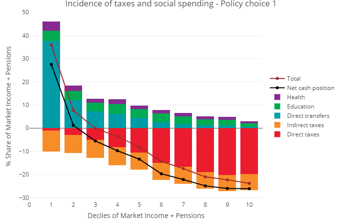
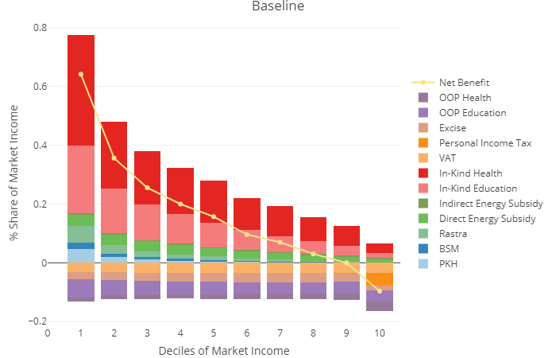
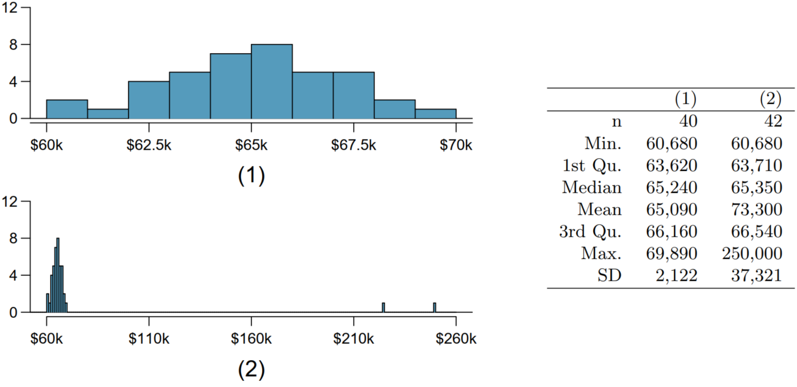
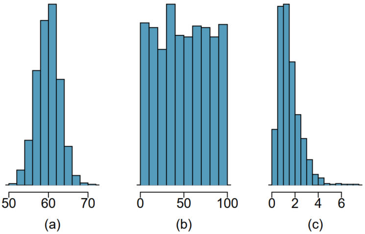
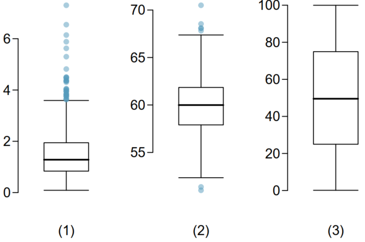

```{r}
#| include: false
source(here::here("materials", "00-setup.R"), local = TRUE)
knitr::opts_chunk$set(fig.width = 8)
knitr::opts_chunk$set(fig.height = 4.5)
```

## Quantiles

-   cut points that divide our data into **equal chunks** with **equal probability of being selected** (equal number of observations in each chunk).

-   Quantiles: Quartiles (4), Deciles (10), Percentiles (100)...

    -   see [Quantiles and Percentiles, Clearly Explained](https://youtu.be/IFKQLDmRK0Y)

-   Range

-   IQR - Interquartile range


## Quartiles: every 25% of observations

```{r}
# qnorm(c(0.25, 0.5, 0.75))
lab_dta <- 
  tibble(x = qnorm(seq(0.125, 0.75+0.125, 0.25)),
         label = "25%")

gg_quart0 <-
  ggplot(NULL, aes(c(-3,3)))  +
  labs(x = "Values", y = "Density") +
  scale_y_continuous(breaks = NULL) +
  scale_x_continuous(breaks = 0, labels = "Median") +
  geom_line(stat = "function", fun = dnorm, xlim = c(-3, 3),
            colour = "black", size = 1) + 
  theme(axis.text.y = element_blank())

gg_quart1_1 <-
  gg_quart0 + 
  geom_area(stat = "function", fun = dnorm, xlim = c(-3, -0.674),
            fill = "black", alpha = 0.15) + 
  scale_x_continuous(
    breaks = c(-3, -0.674, 0, 0.674, 3), 
    limits = c(-3, 3),
    minor_breaks = NULL,
    labels = c("min", 
               "Q1\n1st quartile",
               "Q2\n2nd quartile\nMedian",
               "Q3\n3rd quartile",
               "max")
    ) 

gg_quart1_2 <- 
  gg_quart1_1 + 
  geom_area(stat = "function", fun = dnorm, xlim = c(-0.674, 0),
            fill = "black", alpha = 0.25) 

gg_quart1_3 <- 
  gg_quart1_2 + 
  geom_area(stat = "function", fun = dnorm, xlim = c(0, 0.674),
            fill = "black", alpha = 0.35)

gg_quart2 <- 
  gg_quart1_3 + 
  geom_area(stat = "function", fun = dnorm, xlim = c(0.674, 3),
            fill = "black", alpha = 0.45) +
  geom_label(data = lab_dta, aes(label=label, x = x, y = 0.05)) 

set.seed(123342)
gg_quart_box <-
  tibble(x = rnorm(10000)) %>% 
  filter(x > -3 & x < 3) %>% 
  ggplot() + 
  aes(x = x) + 
  geom_boxplot() + 
  scale_x_continuous(
    breaks = c(-3, -0.674, 0, 0.674, 3), 
    limits = c(-3, 3),
    minor_breaks = NULL,
    labels = c("min", 
               "Q1\n1st quartile",
               "Q2\n2nd quartile\nMedian",
               "Q3\n3rd quartile",
               "max")
    ) + 
  theme(axis.text.y = element_blank(),
        panel.grid.major.y = element_blank(), 
        panel.grid.minor.y = element_blank()) +
  xlab(NULL)

gg_quart_both <- 
  gg_quart2 + 
  gg_quart_box + 
  plot_layout(nrow = 2, heights = c(4, 1))
```

::: r-stack
```{r}
gg_quart0
```

::: fragment
```{r}
gg_quart1_1
```
:::

::: fragment
```{r}
gg_quart1_2
```
:::

::: fragment
```{r}
gg_quart1_3
```
:::

::: fragment
```{r}
gg_quart2
```
:::

::: fragment
```{r}
gg_quart_both
```
:::
:::

## Quartiles: non-normal distribution

```{r}
xx <- c(seq(0, 0.999, 0.25), 0.99) %>% qgamma(shape = 2, rate = 2)
lab_dta <- 
  tibble(
    x = qgamma(seq(0.125, 0.75+0.125, 0.25), shape = 2, rate = 2), label = "25%"
    )
dgg <- function(x) dgamma(x, shape = 2, rate = 2)

gg_gamma2 <-
  ggplot(NULL, aes(range(xx)))  +
  labs(x = NULL, y = NULL) +
  scale_y_continuous(breaks = NULL) +
  # scale_x_continuous(breaks = 0, labels = "Median") + 
  geom_line(stat = "function", fun = dgg, xlim = range(xx),
            colour = "black", size = 1) + 
  theme(axis.text.y = element_blank()) + 
  geom_area(stat = "function", fun = dgg, xlim = c(0.0000000, 0.4806394),
            fill = "black", alpha = 0.15) + 
  geom_area(stat = "function", fun = dgg, xlim = c(0.4806394, 0.8391735 ),
            fill = "black", alpha = 0.25) + 
  geom_area(stat = "function", fun = dgg, xlim = c(0.8391735, 1.3463173),
            fill = "black", alpha = 0.35) + 
  geom_area(stat = "function", fun = dgg, xlim = c(1.3463173, 3.3191760),
            fill = "black", alpha = 0.45) +
  scale_x_continuous(
    breaks = c(0.0000000, 0.4806394, 0.8391735, 1.3463173, 3.3191760), 
    limits = range(xx),
    minor_breaks = NULL,
    labels = c("min", 
               "Q1\n1st quartile",
               "Q2\n2nd quartile\nMedian",
               "Q3\n3rd quartile",
               "max")
    ) + 
  geom_label(data = lab_dta, aes(label=label, x = x, y = 0.05)) 

set.seed(123342)
gg_gamma_box <-
  tibble(x = rgamma(10000, shape = 2, rate = 2)) %>% 
  # filter(x > 0 & x < 3) %>% 
  ggplot() + 
  aes(x = x) + 
  geom_boxplot() + 
  scale_x_continuous(
    breaks = c(0.0000000, 0.4806394, 0.8391735, 1.3463173, 3.3191760), 
    limits = range(xx),
    minor_breaks = NULL,
    labels = c("min", 
               "Q1\n1st quartile",
               "Q2\n2nd quartile\nMedian",
               "Q3\n3rd quartile",
               "max")
    ) + 
  theme(axis.text.y = element_blank(),
        panel.grid.major.y = element_blank(), 
        panel.grid.minor.y = element_blank()) +
  xlab(NULL) +
  expand_limits(x = range(xx))

gg_gamma_both <- 
  gg_gamma2 + 
  gg_gamma_box + 
  plot_layout(nrow = 2, heights = c(4, 1))
```

```{r}
gg_gamma_both
```

## Deciles: every 10% of observations (Normal)

```{r}
#| fig-width: 9
#| fig-height: 5
qdist("norm", seq(.1, .9, by = 0.10), 
      title = "Deciles of a normal distribution", 
      show.legend = T,
      pattern = "rings",
      return = "plot") + 
  theme(legend.position = c(0.8, 0.8))
```

## Deciles: [Gamma distribution](https://en.wikipedia.org/wiki/Gamma_distribution)

```{r}
#| fig-width: 9
#| fig-height: 5
qdist("gamma", 
      seq(.1, .9, by = 0.10), 
       shape = 3,
      title = "Deciles of a gamma distribution", 
      show.legend = T,
      pattern = "rings",
      return = "plot") + 
  theme(legend.position = c(0.8, 0.8))
```

::: footer
See more on the [Gamma distribution](https://en.wikipedia.org/wiki/Gamma_distribution)
:::

## Example (1): income deciles

------------------------------------------------------------------------



## Example (2): inequality, taxes and subsidies (1)

Fiscal policy can redistribute income

::: fragment
-   Taxes could be 'collected' from the 'rich':

    -   Direct taxed: income tax
    -   Indirect taxed: VAT, and excises

-   Subsidies could 'distribute' wealth to the 'poor':

    -   Direct subsidies: unemployment benefits, child support
    -   In-kind subsidies: health and education
    
-   See: <https://commitmentoequity.org/>
:::

::: footer
See [Fiscal Incidence in Armenia](https://commitmentoequity.org/wp-content/uploads/2017/09/CEQ-WP43_Younger-Khachatryan__Armenia_April-2017.pdf) and [FISCAL POLICY IN INDONESIA](https://commitmentoequity.org/wp-content/uploads/2017/09/CEQ-WP40_Jellema-WaiPoi-Afkar_Indonesia_May2017.pdf)
:::

------------------------------------------------------------------------

### The Data

Data below is produced based on the representative HH surveys.

::: fragment
-   For each individual income by sources and expenditure by cause are calculated.

-   Then individuals are aggregated into the deciles of income.

-   Each individual earns *market income*, while taxes and subsidies subtract or add to it.
:::

------------------------------------------------------------------------

### Progressive taxation

{width="100%"}

------------------------------------------------------------------------

### Regressive taxation

{width="100%"}

# Home work

## Robust vs non robust variance {.smaller}

{fig-align="center"}

-   Would the mean or the median best represent the central tendency?

-   What does this say about the robustness of the two measures?

-   Would the standard deviation or the IQR best represent the amount of variability in the incomes?

::: footer
Source: [@Diez2022]
:::

## At home: Match distribution with the box plot

::: columns
::: {.column width="50%"}
{fig-align="left"}
:::

::: {.column width="50%"}

:::
:::

-   Describe the distribution in the histograms below and match them to the box plots.

::: footer
Source: [@Diez2022]
:::
