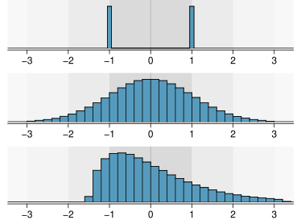

```{r}
#| include: false
source(here::here("materials", "00-setup.R"), local = TRUE)
knitr::opts_chunk$set(fig.width = 8)
knitr::opts_chunk$set(fig.height = 4.5)
```

## Variance {.smaller}

-   `Variance` ($Var[X]$) is a measure of the spread of a distribution relative to its expected value [@Dowdy2004]

    -   is the measure of variability in a single variable;
    -   is the average squared distance from the mean;
    -   is in squared units (**has no intuitive meaning**);

-   `Standard Deviation` (`SD`) is the squared root of the variance:

    -   $\text{SD} = \sqrt{\text{Variance}}$
    -   The standard deviation is
        -   **in the same units of measurement as the measured variable**

## Variance: population vs. sample

::: columns
::: {.column width="50%"}
### Population variance, $\sigma^2$

$$
\sigma^2 = \frac{\sum_{i=1}^N [x_i - \mu]^2 }{N},
$$

where $\mu$ is the population mean:

$\mu = {\sum_{i=1}^N x_i }/{N}$

::: {.fragment fragment-index="1"}
Only used with the population
:::

::: {.fragment fragment-index="2"}
### Standard Deviation:

$\sigma = \sqrt{\sigma^2}$
:::
:::

::: {.column width="50%"}
::: {.fragment fragment-index="3"}
### Sample variance, $s^2$

$$
s^2 = \frac{\sum_{i=1}^N [x_i - \bar{x}]^2 }{N-1},
$$

where $\bar{x}$ is the sample mean:

$\bar{x} = {\sum_{i=1}^N x_i }/{N}$
:::

::: {.fragment fragment-index="4"}
::: {.callout-note appearance="simple"}
#### Most commonly used in statistics
:::
:::

::: {.fragment fragment-index="5"}
### Sample Standard Deviation:

$s = \sqrt{s^2}$
:::
:::
:::


## Standard Deviation

```{r}
gg_sd0 <- 
  ggplot(NULL, aes(c(-3,3)))  +
  labs(x = NULL, y = NULL) +
  scale_y_continuous(breaks = NULL) +
  scale_x_continuous(breaks = 0, labels = "Mean")# +
  # geom_vline(xintercept = 0, linetype = 2, size = 1, data = NULL, inherit_aes = FALSE)
  
gg_sd1 <-
  gg_sd0 +
  scale_x_continuous(
    breaks = -3:3, 
    minor_breaks = NULL,
    labels = c("-3 SD", "-2 SD","-1 SD", "Mean", "1 SD", "2 SD", "3 SD")
    )

gg_sd2 <- 
  gg_sd1 + 
  geom_line(stat = "function", fun = dnorm, xlim = c(-3, 3),
            colour = "black", size = 1) 

gg_sd3 <-
  gg_sd2 + 
  geom_area(stat = "function", fun = dnorm, xlim = c(-1, 1),
            fill = "black", alpha = 0.40) +
  geom_label(aes(label = c("68.3%"), x = c(0), y = c(0.35)))
  
gg_sd4 <-
  gg_sd3 + 
  geom_area(stat = "function", fun = dnorm, xlim = c(-2, -1),
            fill = "black", alpha = 0.25) +
  geom_area(stat = "function", fun = dnorm, xlim = c(1, 2),
            fill = "black", alpha = 0.25) +
  geom_area(stat = "function", fun = dnorm, xlim = c(-3, -2),
            fill = "black", alpha = 0.15) +
  geom_area(stat = "function", fun = dnorm, xlim = c(2, 3),
            fill = "black", alpha = 0.15) +
  geom_label(aes(label = c("13.6%", "13.6%"), x = c(-1.5, 1.5), y = c(0.05, 0.05))) +
  geom_label(aes(label = c("2.1%", "2.1%"), x = c(-2.2, 2.2), y = c(0.01, 0.01)))

```

::: columns
::: {.column width="50%"}
::: {.fragment fragment-index="1"}
represents the "typical" deviation of observations from the mean.
:::

::: {.fragment fragment-index="2"}
If the distribution is **normal**:

-   [68.3% obs. are in +-1 SD;]{.fragment fragment-index="3"}
-   [95.4% obs. are in +-2 SD;]{.fragment fragment-index="4"}
-   [99.7% obs. are in +-3 SD;]{.fragment fragment-index="4"}
:::

::: {.fragment fragment-index="5"}
::: {.callout-important appearance="simple"}
The standard deviation **is in the same units of measurement as the measured variable.**
:::
:::
:::

::: {.column width="50%"}
::: r-stack
::: {.fragment fragment-index="1"}
```{r}
#| fig-width: 5
#| fig-height: 5
gg_sd1
```
:::

::: {.fragment fragment-index="2"}
```{r}
#| fig-width: 5
#| fig-height: 5
gg_sd2
```
:::

::: {.fragment fragment-index="3"}
```{r}
#| fig-width: 5
#| fig-height: 5
gg_sd3
```
:::

::: {.fragment fragment-index="4"}
```{r}
#| fig-width: 5
#| fig-height: 5
gg_sd4
```
:::
:::
:::
:::

## Not every distribution is normal, but SD can be the same

::: columns
::: {.column width="70%"}
{width="100%"}
:::

::: {.column width="30%"}
::: fragment
::: callout-note
A good description of distribution should include

-   Central tendency;

-   SD (Variance);

-   Description of the shape;

    -   modes

    -   symmetry / skew

:::
:::
:::
:::

::: footer
Source: [@Diez2022].
:::