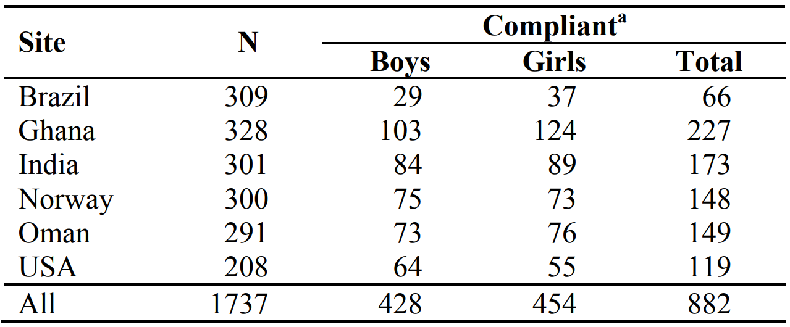
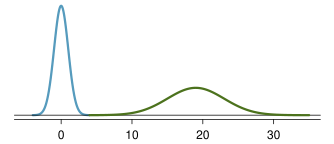

```{r}
#| include: false
source(here::here("materials", "00-setup.R"), local = TRUE)
knitr::opts_chunk$set(fig.width = 8)
knitr::opts_chunk$set(fig.height = 4.5)
```

# Distribution



# Variance



# Quantiles



# Application of variance in the descriptive analysis

## Example: Measuring stunting

### How to measure if a child is stunted?

::: {.fragment fragment-index="1"}
::: callout-important
> Stunting is the impaired growth and development that children experience from poor nutrition, repeated infection, and inadequate psycho-social stimulation

-   Stunting in the first 1000 days of life has negative consequences on the child's physical and mental development.
:::

-   See: [WHO. Stunting in a nutshell](https://www.who.int/news/item/19-11-2015-stunting-in-a-nutshell) and more information on [Hunger and Undernourishment](https://ourworldindata.org/hunger-and-undernourishment#too-little-weight-for-height-wasting).
:::

## Global Stunting

<iframe src="https://ourworldindata.org/grapher/share-of-children-younger-than-5-who-suffer-from-stunting" loading="lazy" style="width: 100%; height: 600px; border: 0px none;" data-external="1">

</iframe>

::: footer
Source: [What is childhood stunting?](https://ourworldindata.org/stunting-definition)
:::

## How to measure if the child is stunted?

```{r}
who_lhfa <- read_rds(here("materials", "data", "who_lhfa.rds"))

girls_gg <-
  who_lhfa %>% 
  filter(Day < 730) %>% 
  filter(gender == "girls") %>%
  ggplot() + 
  aes(x = Day, colour = gender, fill = gender) + 
  geom_line(aes(y = SD0, linetype = "Median"), size = 0.5) + 
  geom_line(aes(y = SD2, linetype = "2SD"), size =  0.5) + 
  geom_line(aes(y = SD2neg, linetype = "2SD"), size =  0.5) + 
  geom_line(aes(y = SD3, linetype = "3SD"), size =  0.5) + 
  geom_line(aes(y = SD3neg, linetype = "3SD"), size =  0.5) + 
  geom_line(aes(y = SD4, linetype = "4SD"), size =  0.5) + 
  geom_line(aes(y = SD4neg, linetype = "4SD"), size =  0.5) + 
  geom_ribbon(aes(ymin = SD0, ymax = SD2), alpha = 0.05, colour = NA) + 
  geom_ribbon(aes(ymin = SD2neg , ymax = SD0), alpha = 0.05, colour = NA) + 
  geom_ribbon(aes(ymin = SD2, ymax = SD3), alpha = 0.15, colour = NA) + 
  geom_ribbon(aes(ymin = SD3neg , ymax = SD2neg), alpha = 0.15, colour = NA) + 
  geom_ribbon(aes(ymin = SD3, ymax = SD4), alpha = 0.25, colour = NA) + 
  geom_ribbon(aes(ymin = SD4neg , ymax = SD3neg), alpha = 0.25, colour = NA) + 
  scale_color_manual(values = c("#c51010", "#088da5"))+ 
  scale_fill_manual(values = c("#c51010", "#088da5")) + 
  # facet_grid(rows = "gender") + 
  ylab("Length/Height in cm") + 
  xlab("Age") + 
  scale_y_continuous(n.breaks = 12) +
  scale_x_continuous(
    breaks = c(0, 14, 35, 60, 90, 120, 150, 180, 270, 360, 15*30, 18*30, 21*30, 24*30),
    labels = c(0, "2W", "5W", "2M", "3M", "4M", "5M", "6M", "9M", "12M", "15M", "18M", "21M", "2Y"),
    minor_breaks = NULL
  ) + 
  scale_linetype_manual(values = c(1, 2, 3, 4),
                        breaks = c("Median", "2SD", "3SD", "4SD"), 
                        name = NULL) +
  guides(fill = guide_none(), colour = guide_none()) + 
  theme(legend.position = c(.5, .1),
        legend.direction = "horizontal", 
        legend.key.width = unit(1.5, "cm")) +
  labs(title = "Weight-for-height: Girls")
```

::: columns
::: {.column width="40%"}
::: fragment
WHO has developed:

-   [Child Growth standards](https://www.who.int/tools/child-growth-standards)
:::

::: fragment
The [Height-for-age](https://www.who.int/tools/child-growth-standards/standards/length-height-for-age) standard stipulates:

-   Lower boundaries of heights without stunting
-   at all ages 0 days - 12 years.
:::
:::

::: {.column width="60%"}
::: fragment
```{r}
#| fig-width: 6.5
girls_gg
```
:::
:::
:::

## Length/Height-for-age in boys and girls

::: columns
::: {.column width="50%"}
```{r}
#| fig-width: 6
girls_gg
```
:::

::: {.column width="50%"}
```{r}
#| fig-width: 6
boys_gg <- 
  girls_gg %+%  
  filter(who_lhfa, gender == "girls", Day < 730) +
  labs(title = "Boys") + 
  scale_color_manual(values = c("#088da5")) + 
  scale_fill_manual(values = c("#088da5")) 
boys_gg
```
:::
:::

## How this standard is made?

::: columns
::: {.column width="50%"}
::: fragment
#### WHO's data collection:



[WHO Child Growth Standards](https://www.who.int/tools/child-growth-standards/standards/length-height-for-age)

::: incremental
-   Random sample of children was followed in each country for several years.

-   Children were regularly screened and measured.
:::
:::
:::

::: {.column width="50%"}
::: fragment
#### Simplified methodology:

::: incremental
For every age group:

-   Mean/median and standard deviation were calculated.

-   Any child with height-for-age within two standard deviations from the mean is considered non-stunting.

-   For a regular population, 95% of children are not stunted.
:::
:::
:::
:::

## How this standard is made?

```{r}
set.seed(121332)
dist_dta <-
  who_lhfa %>%
  filter(Day %in% c(0, 30, 160, 360),
         gender == "boys")  %>%
  rowwise() %>%
  mutate(
    mu = SD0,
    sigma = SD1 - SD0,
    data = map2(mu, sigma, ~{rnorm(10000, .x, .y)})
  ) %>%
  unnest(data) %>%
  mutate(
    z = (data - mu) / sigma,
    Stunting = case_when(
      abs(z) <= 2 ~ "No",
      abs(z) > 2 & abs(z) <= 3  ~ "Severe",
      abs(z) > 3  ~ "Critical"
    ) %>% 
      as_factor() %>% 
      fct_relevel(c("NO",  "Critical", "Severe")),
    y = pmap_dbl(list(z, mu, sigma), ~ {dnorm(..1)})
  ) %>%
  # select(Day, data, Stunting, z, y, mu, sigma) %>% 
  mutate(
    stunting2 = case_when(
      abs(z) <= 2 ~ 1,
      abs(z) > 2 & abs(z) <= 3  ~ 1,
      abs(z) > 3  ~ 2
    ),
    measurement =
      case_when(Day == 0 ~ "Newborn",
                Day == 30 ~ "1 Month",
                Day == 160 ~ "6 month",
                Day == 360 ~ "1 year") %>% 
      as_factor() %>% 
      fct_relevel(c("Newborn", "1 Month", "6 month", "1 year")),
    group = str_c(z > 0, Stunting)
  )# %>% 
  # bind_rows(
  #   filter(., lag(Stunting) != Stunting) %>% 
  #     mutate(Stunting = lag(Stunting)),
  #   # filter(., lead(Stunting) != Stunting) %>% 
  #   #   mutate(Stunting = lead(Stunting))
  # ) %>% 
  # filter(!is.na(Stunting))

dist_gg_0 <- 
  dist_dta %>% 
  # filter(Day == 0)  %>%
  ggplot() + 
  aes(x = data , ymin = 0, ymax = y, group = group,
      fill = Stunting, color = Stunting) + 
  geom_ribbon(alpha = 0.75) +
  facet_wrap(. ~ measurement, ncol = 1, strip.position = "left") +
  xlab("Length/Height in cm") + 
  theme(axis.line.y = element_blank(),
        axis.text.y = element_blank(),
        axis.ticks.y = element_blank()) + 
  scale_x_continuous(n.breaks = 10) + 
  scale_fill_brewer(palette = "YlOrRd", direction = -1)+
  scale_color_brewer(palette = "YlOrRd", direction = -1)


dist_gg_1_1 <- 
   dist_gg_0 %+% 
  ungroup(filter(group_by(dist_dta, measurement),  data == max(data)))

dist_gg_1 <- 
  dist_gg_0 %+% 
  ungroup(filter(
    group_by(dist_dta, measurement),
    measurement %in% c("Newborn") |
      (!measurement %in% c("Newborn") & data == max(data))
  ))

dist_gg_2 <- 
  dist_gg_0 %+% 
  ungroup(filter(
    group_by(dist_dta, measurement),
    measurement %in% c("Newborn", "1 Month") |
      (!measurement %in% c("Newborn", "1 Month") & data == max(data))
  ))

dist_gg_3 <- 
  dist_gg_0 %+% 
  ungroup(filter(
    group_by(dist_dta, measurement),
    measurement %in% c("Newborn", "1 Month", "6 month") |
      (!measurement %in% c("Newborn", "1 Month", "6 month") & data == max(data))
  ))
```

::: r-stack
```{r}
dist_gg_1_1
```

::: fragment
```{r}
dist_gg_1
```
:::

::: fragment
```{r}
dist_gg_2
```
:::

::: fragment
```{r}
dist_gg_3
```
:::

::: fragment
```{r}
dist_gg_0
```
:::
:::

## The stanard summary

Practically, WHO's data collected on the healthy population helped defining

-   probability distribution of **heights** for age and gender of children.

::: fragment
-   Mean/Median height
-   Standard deviation of height
-   The distribution is normal
:::

::: fragment
Stunting was defined as:

-   Having actual height 2 standard deviation lower than the central tendency in the healthy population.
:::

## Application: let us follow a boy's development:

```{r}
bb <- 
  tibble(
    x = c(1, 36, 73, 144, 251, 462, 610, 700),
    y = c(42, 48, 51, 59, 67, 73, 77, 81)
    )
```

::: fragment
```{r}
boys_gg + 
  geom_path(data = bb, aes(x = x, y = y), inherit.aes = FALSE) + 
  geom_point(data = bb, aes(x = x, y = y), inherit.aes = FALSE)
```
:::


# The (Satandard) Normal Distribution

::: columns
::: {.column width="40%"}
::: {.fragment fragment-index="1"}
Is the symmetric, bell-shaped normal distribution, whit:
:::

::: {.fragment fragment-index="3"}
-   $\mu = 0$,

-   $\text{SD} = 1$.
:::

::: {.fragment fragment-index="4"}
-   X axis contains z-scores.
:::
:::

::: {.column width="60%"}
```{r}
st_norm_0 <- 
  ggplot(NULL, aes(c(-3,3)))  +
  labs(x = NULL, y = NULL) +
  scale_y_continuous(breaks = NULL) +
  scale_x_continuous(breaks = -3:3, minor_breaks = NULL, labels = NULL)

st_norm_1 <- 
  st_norm_0 + 
  geom_line(stat = "function", fun = dnorm, xlim = c(-3, 3),
            colour = "black", size = 1) 

st_norm_2 <- 
  st_norm_1 + 
  scale_x_continuous(breaks = -3:3, minor_breaks = NULL, 
                     labels = c("-3\n-3SD", "-2\n-2SD", "-1\n-1SD", "0\nMean",
                                "1\n-1SD", "2\n-2SD", "3\n-3SD")) + 
  xlab("z-score")
```

::: r-stack
::: {.fragment fragment-index="2"}
```{r}
#| fig-width: 5
#| fig-height: 4
st_norm_1
```
:::

::: {.fragment fragment-index="3"}
```{r}
#| fig-width: 5
#| fig-height: 4
st_norm_2
```
:::
:::
:::
:::

## Z-score

The Z-score of an observation $x$ is the `number of standard deviations` $s$ that it ($x$) falls above or below the mean $\bar x$.

::: fragment
We can compute a z-score of every observation $x$ in our sample. For that we need:

-   sample mean $\bar x$, and
-   sample standard deviation, $s$.
:::

::: fragment
$$
Z = \frac{x-\bar x}{s}
$$
:::

::: fragment
Please memorize it! 
:::

::: footer
Source: [@Diez2022].
:::

## Why do we need it?

::: columns
::: {.column width="25%"}
Often, we need to compare distributions or locate individual observations on distributions.
:::

::: {.column width="75%"}
::: fragment
{width="100%"}
:::
:::
:::

::: fragment
This is difficult, when values are expressed in the absolute terms.
:::

::: footer
Image source: [@Diez2022].
:::

## Standardization

The process of converting any value of any distribution to the standard normal distribution.

::: columns
::: {.column width="50%"}
::: fragment
$$
Z = \frac{x-\bar x}{s}
$$
:::
:::

::: {.column width="50%"}
::: fragment
where:

-   $\bar x$ is the mean, and
-   $s$ is the SD, and
-   $x$ is the observation.
:::
:::
:::

## Example (exam): det. stunting status (1)

Stunting is defined **as having heights** `2 standard deviations lower` **then the average height of a healthy child** of the same gender and age.

::: columns
::: {.column width="50%"}
::: fragment
We've measured that:

-   a 5 years old girl
-   has heights of 97 cm.

**Can we consider her suffering from stunting?**
:::
:::

::: {.column width="50%"}
::: fragment
According to the [Child Growth Standards](https://www.who.int/publications/i/item/9789241547635) about [height-for-age](https://www.who.int/tools/child-growth-standards/standards/length-height-for-age), the height of a healthy girl at the age of 5 years old:

-   is normally distributed with
-   the mean $\mu = 109$ cm and
-   the SD $s = 4.73$ cm.
:::
:::
:::

## Example (exam): det. stunting status (2)

Computing the z-score of the observation:

::: fragment
$$
Z = \frac{97 - 109}{4.73} = \frac{-12}{4.73} = -2.54
$$
:::

::: fragment
Conclusion:

-   Observed height of a 5 y.o. girl falls below -2 standard deviations.

-   Thus she might be suffering from stunting if other causes of growth deprevation (e.g. genetic) are eliminated.
:::

# Homework examples

## Compute z-score

1.  The boy's height is 76 cm. He is 1.5 Years old.

    -   Is this boy stunted given that the expected height in the corresponding population of that age is 80.3 and the SD is 2.6?
    -   Calculate corresponding statistics and write a brief conclusion.

2.  The girl's weight is 13.8 kg. She is 5 years old.

    -   Does this girl suffer from waisting?
    -   Expected weight in the corresponding population of that age is 18.3 and the SD is 2.05?
    -   Calculate corresponding statistics and write a brief conclusion.

## Exam questions on variance

-   What is variance and how is it different from the standard deviation.

-   When the mean and the standard deviation are not the best measures of respectively the central tendency and the variance?

    -   What are the alternative methods?

-   Assume that the distribution is normal. What share of observations falls withing two SD of mean?

-   How the quantiles are constructed?

-   Is median one of the quantiles or this is the central tendency?

-   What robust measures of variance do you know?

## Exam questions on the Normal distribution

-   What is the difference between a normal distribution of age and a standard normal distribution?

-   What is the z-score?

# When univariate data analysis is not enough?

## Datasaur: Synthetic data (1) {.smaller}

```{r}
saur_dta <- read_tsv(here("materials", "data", "DatasaurusDozen.tsv"))
sum_stats <- 
  saur_dta %>%
  group_by(dataset) %>%
  summarise(
    across(x:y, ~ mean(., na.rm  = T), .names = "mean_{.col}")#,
    # corr_xy = cor(x, y)
  ) %>%
  mutate(across(where(is.numeric), ~ round(., 2))) %>%
  kable()
```

::: columns
::: {.column width="30%"}
::: incremental
-   There are 13 synthetic data sets that produce similar descriptive statistics and distributions:
:::
:::

::: {.column width="50%"}
::: fragment
```{r}
sum_stats
```
:::
:::
:::

::: footer
Data source: [@Cairo2016] and [@Matejka2017]
:::

## Univariate analysis of the Datasaur (1)

```{r}
saur_dta %>%
  filter(dataset != "away") %>%
  ggplot() +
  aes(x = x, colour = dataset) +
  geom_boxplot() +
  facet_wrap(. ~ dataset, scales = "free_y") +
  theme_minimal() +
  theme(legend.position = "none")
```

::: footer
Data source: [@Cairo2016] and [@Matejka2017]
:::

## Univariate analysis of the Datasaur (2)

```{r}
saur_dta %>%
  filter(dataset != "away") %>%
  ggplot() +
  aes(x = x, colour = dataset, fill = dataset) +
  geom_histogram(bins = 20) +
  facet_wrap(. ~ dataset, scales = "free_y") +
  theme_minimal() +
  theme(legend.position = "none")
```

::: footer
Data source: [@Cairo2016] and [@Matejka2017]
:::

## Bi-variate distribution is important!

```{r}
saur_dta %>%
  filter(dataset != "away") %>%
  ggplot() +
  aes(x, y, colour = dataset) +
  geom_point() +
  facet_wrap(. ~ dataset) + theme_minimal() +
  theme(legend.position = "none")
```


# Takeaways checklist

## Read more about income inequality at [Our World in Data](https://ourworldindata.org/economic-inequality#research-writing) {.smaller}

-   [The history of global economic inequality](https://ourworldindata.org/the-history-of-global-economic-inequality)

-   [Global Inequality of Opportunity](https://ourworldindata.org/global-inequality-of-opportunity)

-   [Global economic inequality: what matters most for your living conditions is not who you are, but where you are](https://ourworldindata.org/global-economic-inequality-introduction)

-   [Income inequality before and after taxes: How much do countries redistribute income?](https://ourworldindata.org/income-inequality-before-and-after-taxes)

-   [OWID Data Collection: Inequality and Poverty](https://ourworldindata.org/owid-data-collection-inequality-and-poverty)

-   [How has inequality in the United Kingdom changed over the long run?](https://ourworldindata.org/how-has-inequality-in-the-uk-changed-over-the-very-long-run)

-   [How unequal were pre-industrial societies?](https://ourworldindata.org/how-unequal-were-pre-industrial-societies)

-   [How has income inequality within countries evolved over the past century?](https://ourworldindata.org/how-has-income-inequality-within-countries-evolved-over-the-past-century)

## Read also: 

Read the paper below **before week 4**: [@Kuchenbecker2017]

-   Kuchenbecker, J., Reinbott, A., Mtimuni, B., Krawinkel, M. B., & Jordan, I. (2017). Nutrition education improves dietary diversity of children 6-23 months at community-level: Results from a cluster randomized controlled trial in Malawi. PLOS ONE, 12, e0175216.

-   Available on Ilias.

## Key concepts covered in the lecture {.smaller}

::: columns
::: {.column width="50%"}
Univariate data 

The Histogram:

-   bars, frequencies, bins and bins width;

The Density plot:

-   Density vs frequency;
-   How to make a density plot;

The Cumulative distribution:

-   How to make it;
-   Equal vs unequal distribution;
-   Lorenz Curve;
:::

::: {.column width="50%"}
The Variance:

-   Robust vs non robust statistical measures of variance;
-   Variance and Standard deviation;
-   Use of SD;
-   Units of measurement in SD;
-   1, 2, 3 SD from the mean/median;

The Normal Distribution:

-   Mean and Variance in the Normal distribution;
-   Standard normal distribution;
-   Z-scores and standardization;
:::
:::

# References
