```{r}
#| include: false
source(here::here("materials", "00-setup.R"), local = TRUE)
```


# Bi-variate data

Data on two variables:

::: incremental
-   Where each variable is paired with another.
:::

## Example of Bi-viriate data... (1)

::: fragment
### are Palmer[penguins](https://allisonhorst.github.io/palmerpenguins/articles/art.html) !!!

{.absolute top="75" left="0" width="90%"}
:::

::: footer
see: [palmerpenguins](https://allisonhorst.github.io/palmerpenguins/articles/art.html)
:::

## Example of Bi-viriate data... (2)

{.absolute top="75" left="0" width="800"}

::: fragment
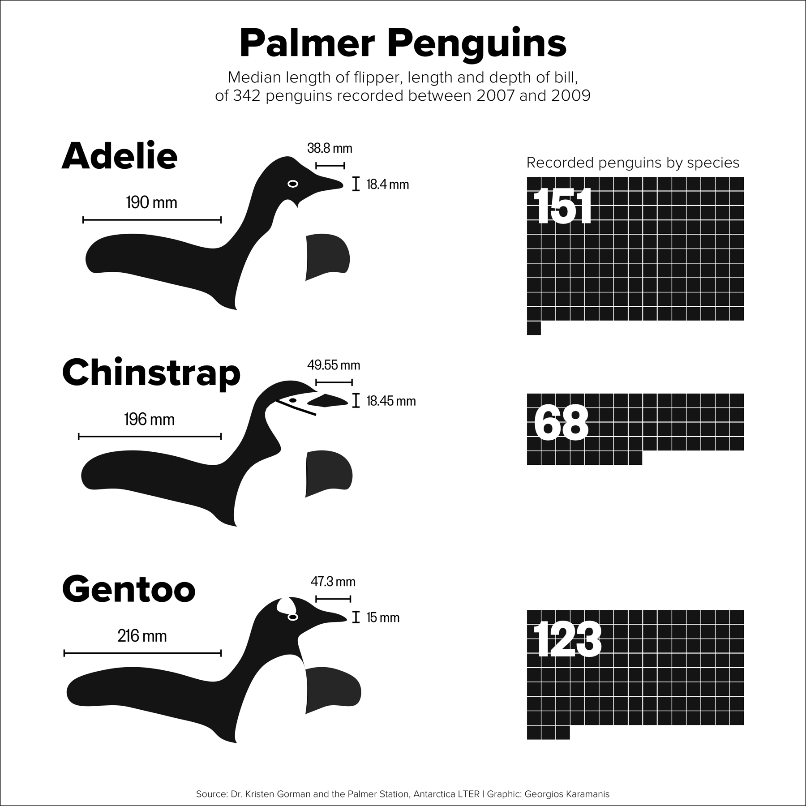{.absolute bottom="25" right="0" width="350"}
:::

## Building a scatter plot with penguins

::: r-stack
```{r}
#| fig-width: 8
#| fig-height: 4
ping_1 <- 
  penguins %>%
  ggplot(aes(x = flipper_length_mm, y = bill_length_mm)) +
  # geom_point(aes(color = species, shape = species)) +
  labs(
    title = "Flipper and bill length",
    x = "Flipper length (mm)",
    y = "Bill length (mm)",
    color = "Penguin species",
    shape = "Penguin species"
  ) 

ping_2 <- ping_1 + geom_point(size = 4, alpha = 0.5)
ping_3 <- ping_2 + aes(color = species)
ping_4 <- ping_3 + aes(shape = species)
ping_1
```

::: fragment
```{r}
#| fig-width: 8
#| fig-height: 4
ping_2
```
:::

::: fragment
```{r}
#| fig-width: 8
#| fig-height: 4
ping_3
```
:::

::: fragment
```{r}
#| fig-width: 8
#| fig-height: 4
ping_4
```
:::
:::

# Scatter plot

> Type of a plot that shows the relationship between two numeric variables.

::: fragment
Convention:

-   $x$ is the horizontal axis and $y$ is the vertical;
-   $x$ changes first and then $y$ follows;
-   if any causality is implied, $x$ causes $y$;
:::

::: fragment
More information:

-   Khan Academy. [Unit: Exploring bivariate numerical data](https://www.khanacademy.org/math/statistics-probability/describing-relationships-quantitative-data). [Introduction to scatter plots](https://www.khanacademy.org/math/statistics-probability/describing-relationships-quantitative-data#:~:text=in%20this%20unit-,Introduction%20to%20scatterplots,-Learn)
:::

## Good scatter plot is self explaining {.smaller}

```{r}
uganda_dta <-
  here("data-raw",
       "uganda-poject",
       "Uganda_B_E_agri and nutrition 04.06.2018.sav") %>% 
  read_sav()
# 
# uganda_dta %>% 
#   select(1:20) %>% 
#   labelled::generate_dictionary(values = FALSE)

ugd_height_weight <-
  uganda_dta %>% 
  select(contains("CHWEIGHHAV_"), contains("CHHEIGHHAV_"),
         contains("HAZ"), contains("WAZ"), contains("WHZ"), 
         NUTREneu_E, 
         HHID_B,
         ageindays_B) %>% 
  pivot_longer(c(contains("CHWEIGHHAV_"), contains("CHHEIGHHAV_"),
         contains("HAZ"), contains("WAZ"), contains("WHZ"))) %>% 
  separate(name, c("Variable", "Line")) %>% 
  pivot_wider(
    names_from = "Variable", 
    values_from = "value"
  ) %>% 
  mutate(
    Line = ifelse(Line == "B", "Baseline survey", "Endline survey") %>% 
      as.factor(),
    Status = if_else(HAZ < -2, "Stunted", "Normal") %>% as.factor()
    ) %>% 
  filter(!is.na(Status))


ugd_gg_0 <- 
  ugd_height_weight %>% 
  ggplot() + 
  aes(x = CHWEIGHHAV, y = CHHEIGHHAV) + 
  labs(title = "Height and weight of children under 36 m.o. enrolled in  Uganda", 
       subtitle = "Collected among HH enrolled to the dietary divercity RCT experiment", 
       caption = 
         "Source: Jordan I, Röhlig A, Glas MG, Waswa LM, Mugisha J, Krawinkel MB, Nuppenau E-A. Dietary Diversity of Women across \nAgricultural Seasons in the Kapchorwa District, Uganda: Results from a Cohort Study. Foods. 2022; 11(3):344. \nhttps://doi.org/10.3390/foods11030344") + 
  scale_x_continuous(n.breaks = 10) + 
  scale_y_continuous(n.breaks = 10) + 
  xlab(" ")+ 
  ylab(" ")


ugd_gg_0a <- ugd_gg_0 + xlab("Children height, cm") + ylab("Children weight, kg")
ugd_gg_1 <- ugd_gg_0a + geom_point()
ugd_gg_2 <- ugd_gg_1 + aes(color = Status) + theme(legend.position = c(0.8, 0.2))
ugd_gg_3 <- ugd_gg_2 + facet_wrap(. ~ Line)
```

::: columns
::: {.column width="30%"}
It contains:

[Title and sources]{.fragment fragment-index="1"}

[Axis labels, units]{.fragment fragment-index="2"}

[Points]{.fragment fragment-index="3"}

[Legends]{.fragment fragment-index="4"}

[Temporal dimension]{.fragment fragment-index="5"}
:::

::: {.column width="70%"}
::: r-stack
::: {.fragment fragment-index="1"}
```{r}
#| fig-width: 7
#| fig-height: 5.5
ugd_gg_0
```
:::

::: {.fragment fragment-index="2"}
```{r}
#| fig-width: 7
#| fig-height: 5.5
ugd_gg_0a
```
:::

::: {.fragment fragment-index="3"}
```{r}
#| fig-width: 7
#| fig-height: 5.5
ugd_gg_1
```
:::

::: {.fragment fragment-index="4"}
```{r}
#| fig-width: 7
#| fig-height: 5.5
ugd_gg_2
```
:::

::: {.fragment fragment-index="5"}
```{r}
#| fig-width: 7
#| fig-height: 5.5
ugd_gg_3
```
:::
:::
:::
:::


# Trend line

Is the line that best outlines a linear trend in the relationship between $x$ and $y$.

More information:

-   Khan Academy. [Unit: Exploring bivariate numerical data](https://www.khanacademy.org/math/statistics-probability/describing-relationships-quantitative-data). [Introduction to trend lines](https://www.khanacademy.org/math/statistics-probability/describing-relationships-quantitative-data#:~:text=Start%20quiz-,Introduction%20to%20trend%20lines,-Learn)

## Trend line {.smaller}

::: columns
::: {.column width="30%"}
Trend line is also a 

-   Simple linear regression line
:::

::: {.column width="70%"}
::: r-stack
```{r}
#| fig-width: 7
#| fig-height: 5.5
ugd_gg_1
```

::: {.fragment}
```{r}
#| fig-width: 7
#| fig-height: 5.5
ugd_gg_1  +
  geom_smooth(method = "lm", se = FALSE)
```
:::

::: {.fragment}
```{r}
#| fig-width: 7
#| fig-height: 5.5
ugd_gg_2  +
  geom_smooth(method = "lm", se = FALSE)
```
:::

::: {.fragment}
```{r}
#| fig-width: 7
#| fig-height: 5.5
ugd_gg_3  +
  geom_smooth(method = "lm", se = FALSE)
```
:::
:::
:::
:::

## Trend line examples

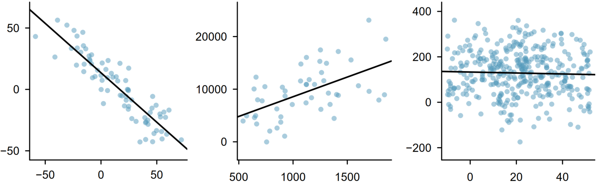{fig-align="center" width="100%"}

# Examples

## Describe the scatter plots (1)

What are the associations between X and Y? (positive/negative, linear/nonlinear)

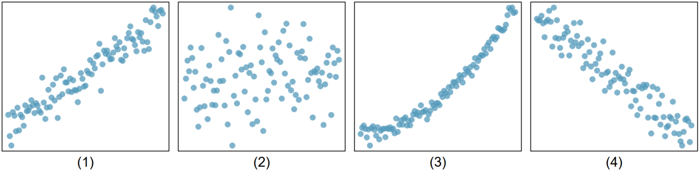

## Describe the scatter plots (2)


What are the associations between X and Y? (positive/negative, linear/nonlinear)

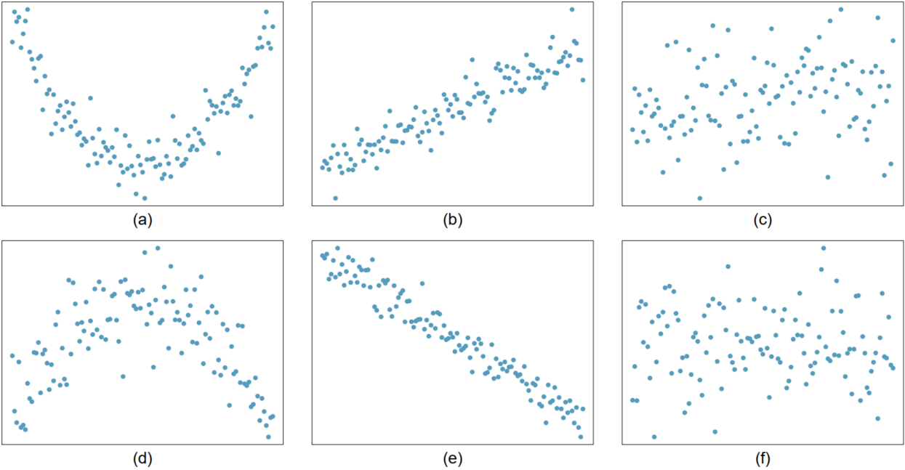

# Homework

## More examples (1) {.smaller}

::: columns
::: {.column width="70%"}
```{r}
#| fig-width: 7
#| fig-height: 5.5
library(dslabs)
library(ggrepel)
library(ggthemes)
# data(murders)
r <- murders |> 
  summarize(rate = sum(total) /  sum(population) * 10^6) |>
  pull(rate)
murders |> 
  ggplot(aes(population/10^6, total, label = abb)) +   
  # geom_abline(intercept = log10(r), lty = 2, color = "darkgrey") +
  geom_point(aes(col=region), size = 3) +
  geom_smooth(aes(linetype = "Trend line"), method = lm, se = FALSE) +
  geom_text_repel() + 
  scale_x_log10() +
  scale_y_log10() +
  annotation_logticks() + 
  xlab("Populations in millions (log scale)") + 
  ylab("Total number of murders (log scale)") +
  ggtitle("US Gun Murders in 2010") + 
  scale_color_discrete(name = "Region") +
  scale_linetype(NULL) +
  theme_bw()
```
:::

::: {.column width="30%"}
-   Describe the scatter plot.

    1.  What is displayed? What is the plot type?
    2.  What is on X and Y axis? Are those transformed, how?
    3.  What points show. What shape/color/size stands for?

-   Summaries the relationship between Y ans X.

    1.  Positive/negative.
    2.  Linear non-linear.
:::
:::

## More examples (2) {.smaller}

::: columns
::: {.column width="70%"}
```{r}
#| fig-width: 7
#| fig-height: 5.5
library(dslabs)
library(ggrepel)
library(ggthemes)
# data(temp_carbon)
temp_carbon |>
  arrange(year) |> 
  mutate(decade = 
           case_when(year < 1900 ~ "before 1990",
                     year < 1940 ~ "1901-1940",
                     year < 1980 ~ "1941-1980",
                     year < 2000 ~ "1981-2000",
                     year < 2025 ~ "after 2000") |> 
           as_factor()) |> 
  # glimpse() |> 
  ggplot() + 
  aes(x = ocean_anomaly, y =land_anomaly, size = carbon_emissions, colour = decade) +   
  geom_point() + 
  xlab("Land temperature anomalies") + 
  ylab("Ocean temperature anomalies") +
  ggtitle(
    label = "Temperature anomalies and emissions over time", 
    subtitle = "Measured in C\u00b0 difference from XIXth century average") + 
  scale_color_discrete(name = "Period") +
  scale_size(name = "Annual carbon emissions, mln. MT") +
  scale_linetype(NULL) +
  theme_bw()
```
:::

::: {.column width="30%"}
-   Describe the scatter plot.

    1.  What is displayed? What is the plot type?
    2.  What is on X and Y axis? Are those transformed, how?
    3.  What points show. What shape/color/size stands for?

-   Summaries the relationship between Y ans X.

    1.  Positive/negative.
    2.  Linear non-linear.
:::
:::

## Draw a linear trend line between x and y

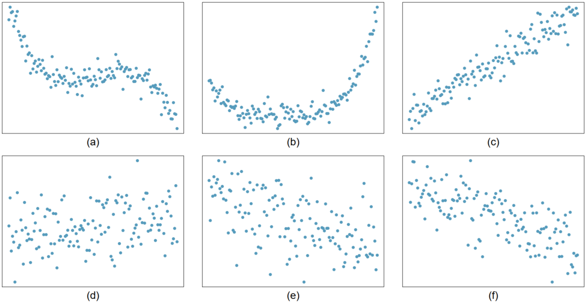

# Correlation (coefficient)

> is a measure of a statistical relationship (not necessarily causal) between two variables.

-   Tells us how strongly/weakly two variables co-relate with each other.

See:

-   Josh Starmer: [Pearson's Correlation, Clearly Explained!](https://youtu.be/xZ_z8KWkhXE)

-   [Interpretation of the strength of correlation](https://easystats.github.io/effectsize/articles/interpret.html).

-   Khan Academy. [Unit: Exploring bivariate numerical data](https://www.khanacademy.org/math/statistics-probability/describing-relationships-quantitative-data). [Correlation coefficients](https://www.khanacademy.org/math/statistics-probability/describing-relationships-quantitative-data#scatterplots-and-correlation:~:text=Practice-,Correlation%20coefficients,-Learn)

## Methodology {.smaller}

There are many [methods of calculating a correlation coefficient](https://easystats.github.io/correlation/articles/types.html#different-methods-for-correlations):

::: fragment
### Pearson's correlation coefficient
:::

::: columns
::: {.column width="50%"}
::: fragment
#### Population correlation

$$
r_{xy} = \frac{1}{N} \sum _{i=1}^{N} \frac{x_{i} - \mu_{x}}{\sigma_{x}} \frac{y_{i} - \mu_{y}}{\sigma_{y}}
$$
:::

::: fragment
where:

-   $r_{xy}$ is the correlation coefficient;
-   $x_i$ and $y_i$ are bi-variate observations;
-   $\mu_x$ and $\mu_y$ are the population means;
-   $\sigma_x$ and $\sigma_y$ are the population standard deviations;
:::
:::

::: {.column width="50%"}
::: fragment
#### Sample correlation

$$
R_{xy} = \frac{1}{n-1} \sum _{i=1}^{n} \frac{x_{i} - \bar{x}}{s_{x}} \frac{y_{i} - \bar{y}}{s_{y}}
$$
:::

::: fragment
where:

-   $R_{xy}$ is the correlation coefficient;
-   $\bar x$ and $\bar y$ are the sample means;
-   $s_x$ and $s_y$ are the sample standard deviations;
:::
:::
:::

## Interpretation {.smaller}

Correlation coefficient represents [**ONLY LINEAR**]{style="color: red;"} relationship between two variables

It describe the strength of a relationship and its direction

::: columns
::: {.column width="40%"}
::: fragment
::: incremental
Strength of a relationship by [J. Cohen (1988)](https://easystats.github.io/effectsize/articles/interpret.html#cohen1988statistical)

-   $r < 0.1$ Very small / weak

-   $0.1 <= r < 0.3$ Small

-   $0.3 <= r < 0.5$ Moderate

-   $r >= 0.5$ Large / strong
:::
:::
:::

::: {.column width="60%"}
::: fragment
Positive correlation: $r > 0$

-   $x$ and $y$ relate proportionally.
-   An **increase** in $x$ ($y$) is associated with an **increase** in $y$ ($x$).
:::

::: fragment
Negative correlation: $r < 0$

-   $x$ and $y$ relate inversely;
-   An **increase** in $x$ ($y$) is associated with a **decrease** in $y$ ($x$).
:::
:::
:::

## Correlation examples (1)

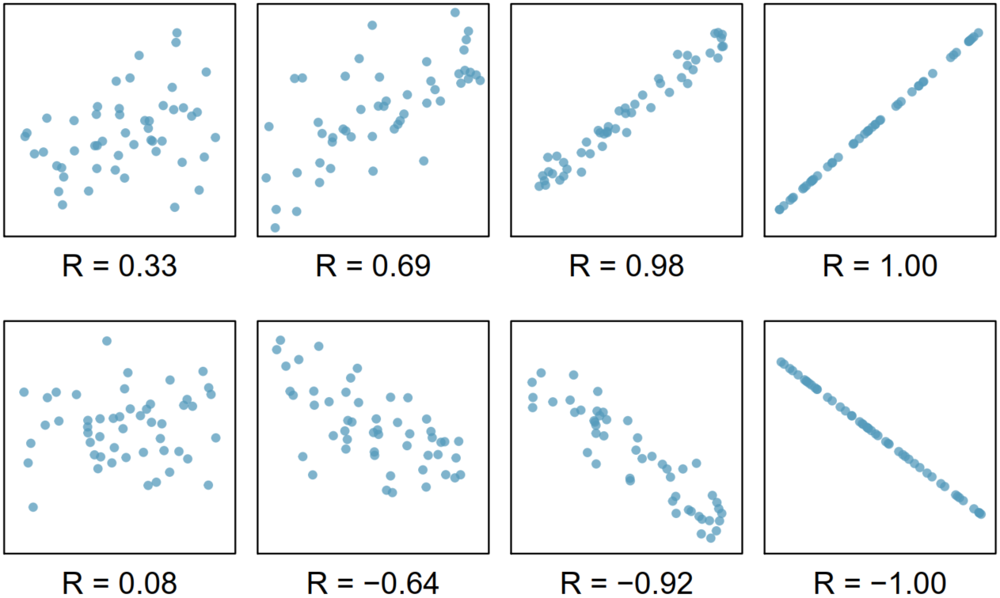

::: footer
Source: [@Diez2022].
:::

## Correlation examples (2)

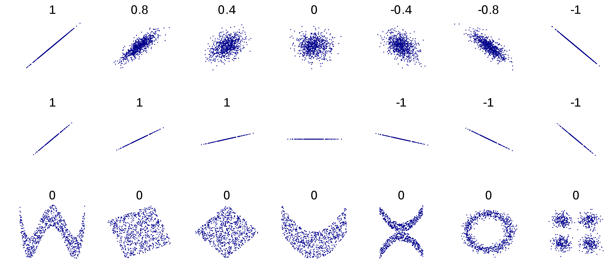

## Correlation pitfalls: Non-linearity

Correlation cannot be used with the non-linear data.

::: fragment
-   Non linear data yields a correlation coefficient, but such coefficient does not imply any linear relationship.
:::

::: fragment
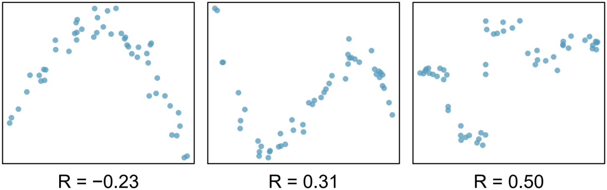
:::

::: footer
Source: [@Diez2022; @Gerbrandy1972].
:::

## Correlation pitfalls

```{r}

# penguins %>% 
#   summarise(cor(flipper_length_mm, bill_depth_mm, use = "complete.obs"))
# 
# penguins %>% 
#   group_by(species) %>% 
#   summarise(cor(flipper_length_mm, bill_depth_mm, use = "complete.obs"))

peng_cor_gg0 <- 
  penguins %>%
  ggplot(aes(x = flipper_length_mm, y = bill_depth_mm )) +
  geom_point() +
  labs(
    title = "Flipper and bill length",
    x = "Flipper length (mm)",
    y = "Bill depth (mm)",
    color = "Penguin species",
    shape = "Penguin species"
  ) +
  geom_smooth(aes(x = flipper_length_mm, y = bill_depth_mm ),
              method = "lm", se = FALSE, color = "red", inherit.aes = FALSE)+
  geom_label(x = 175, y = 20, label = "Corr. Coef = -0.584", inherit.aes = FALSE)


peng_cor_gg1 <- 
  peng_cor_gg0 +
  aes(color = species, shape = species)

peng_cor_gg2 <- 
  peng_cor_gg0 +
  geom_smooth(aes(group = species, color = species), method = "lm", se = FALSE) +
  geom_label(x = 172, y = 17.8, label = "Corr. Coef = 0.308", inherit.aes = FALSE) +
  geom_label(x = 185, y = 16.5, label = "Corr. Coef = 0.580", inherit.aes = FALSE) +
  geom_label(x = 200, y = 14.5, label = "Corr. Coef = 0.707", inherit.aes = FALSE)

```

::: r-stack
```{r}
peng_cor_gg0
```

::: fragment
```{r}
peng_cor_gg1
```
:::

::: fragment
```{r}
peng_cor_gg2
```
:::
:::

## Correlation matrix (1): Penguins


::: columns
::: {.column width="50%"}
```{r}
library(flextable)
library(correlation)
penguins %>% 
  select(bill_length_mm:body_mass_g) %>% 
  correlation() |> 
  as_tibble() |> select(1:3) |> 
  flextable()
```
:::

::: {.column width="50%"}
::: fragment
```{r}
penguins %>% 
  select(bill_length_mm:body_mass_g) %>% 
  correlation() |> summary() |> 
  mutate(across(where(is.character), ~ str_replace_all(., "\\*", ""))) |> 
  as_tibble() |> flextable()
```
:::
:::
:::

::: fragment
```{r}
#| fig-height: 2.5
#| fig-width: 8
penguins %>% 
  select(bill_length_mm:body_mass_g) %>% 
  correlation() |> summary() |> plot()
```
:::

# Homework

## Correlation

::: fragment
### Match a correlation coefficient and a plot

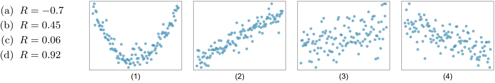
:::

------------------------------------------------------------------------

### Match a correlation coefficient and a plot

::: fragment
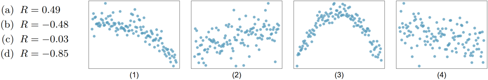
:::

::: fragment
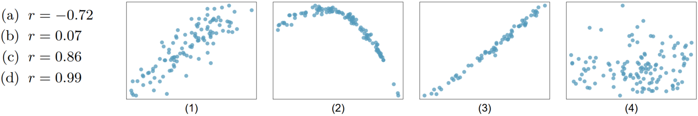
:::

------------------------------------------------------------------------

### Identify the relationship and its strength (1)


------------------------------------------------------------------------

### Identify the relationship and its strength (2)


## Spurious correlation (link)

Explore at home on your own:

-   <https://www.tylervigen.com/spurious-correlations>

-   Define what is "spurious correlation"?

# Correlation and Causation

If $x$ correlates with $y$, does is mean that $x$ causes $y$?

::: incremental
-   Correlation does not imply causation!
:::

## Do we live longer because of the low birth rate? {.smaller}

```{r}
un_dta <- alr4::UN11 %>% as_tibble()

un_gg_0 <- 
  un_dta %>%
  ggplot() +
  aes(x = fertility, y = lifeExpF) +
  geom_point(size = 3) +
  theme_bw() +
  labs(
    title = "Relationship between fertility and life expectancy",
    y = "Life expectancy at birth, years",
    x = "Fertility, children per woman", 
    caption = "Data source: Weisberg, S. (2014). Applied Linear Regression")

un_gg_1 <- un_gg_0 + geom_smooth(method = "lm", se = FALSE, colour = "red")
un_gg_2 <- un_gg_1 + aes(color = group)  + theme(legend.position = c(.8, .8))
un_corr <- cor(un_dta$lifeExpF, un_dta$fertility) %>% round(3)
```

::: columns
::: {.column width="60%"}
::: r-stack
```{r}
#| fig-width: 7
#| fig-height: 6
un_gg_0
```

::: {.fragment fragment-index="3"}
```{r}
#| fig-width: 7
#| fig-height: 6
un_gg_1
```
:::

::: {.fragment fragment-index="4"}
```{r}
#| fig-width: 7
#| fig-height: 6
un_gg_2
```
:::
:::
:::

::: {.column width="40%"}
::: {.fragment fragment-index="1"}
The correlation between Fertility and life expectancy is `r un_corr`.

-   What does this mean?
:::

::: {.fragment fragment-index="2"}
-   Can we imply that giving fewer births will increase life expectancy?
:::

::: {.fragment fragment-index="3"}
-   What does the linear trend suggests?
:::

::: {.fragment fragment-index="4"}
-   Does being from a different country groups causes this trend?
:::

::: {.fragment fragment-index="5"}
[No... None of it implies causality.]{style="color: red;"}
:::
:::
:::

## To establish a causal relationship

::: incremental
-   We need to establish a [**"Ceteris Paribus"**!]{style="color: green;"}

-   We need to make sure that [**"other things are equal"**]{style="color: red;"} between the countries.

-   For example:

    -   All countries consist of identical people with identical socioeconomic characteristics.
    
    -   The only differences are in their fertility rates and (perhaps) life expectancy.
:::

# Homework

To better understand how data can be used to communicate a complex story, check out the following videos and exercises.

## New insights on the HIV pandemic

The purpose of the following short video is to stimulate debate on the **covariates, and causes** of the HIV pandemic worldwide.

::: fragment
After watching it, discuss:

-   Facts of the HIV/AIDS pandemic;
-   Country-specific peculiarities that correlate with the pandemic.
-   What causes the pandemic to spread at so different rates across the countries?
:::

Video source: [Insights on HIV, in stunning data visuals](https://www.ted.com/talks/hans_rosling_insights_on_hiv_in_stunning_data_visuals?language=en)

## Insights on HIV, in stunning data visuals

::: {style="max-width:100%"}
::: {style="position:relative;height:0;padding-bottom:56.25%"}
<iframe src="https://embed.ted.com/talks/lang/en/hans_rosling_insights_on_hiv_in_stunning_data_visuals" width="854" height="480" style="position:absolute;left:0;top:0;width:100%;height:100%" frameborder="0" scrolling="no" allowfullscreen>

</iframe>
:::
:::

::: footer
Source: [Insights on HIV, in stunning data visuals](https://www.ted.com/talks/hans_rosling_insights_on_hiv_in_stunning_data_visuals)
:::

## . {background-image="img/gapminder_hiv_chart_feb09_a-1.png" background-size="contain"}

## Key Messages:

-   No simple answer to the complex question.

-   There are no two types of countries one with and another without the HIV pandemic.

To see more, visit:

-   [gapminder.org](https://www.gapminder.org/)

-   [Ted talks of Hans Rosling](https://www.ted.com/speakers/hans_rosling)

## At home: Explore the best use of a scatter plots with [Gapminder](https://www.gapminder.org/)

Play with data using gap minder:

-   <https://www.gapminder.org/tools/>

Watch some Hans Rosling's Ted Talks:

-   <https://www.youtube.com/playlist?list=PLSrgd_ElrrXegdtDHPmUzrzLpwZ2dSYKg>

Explore the gap-minder foundation channel

-   <https://www.youtube.com/channel/UCMbmqUMqzerMSM48pGYMYsg>

# Example: Rice yields and fertilizers application {.smaller .nonincremental}

Research question: 

-   How does the urea application affect the yields of rice?

The sample of 171 rice farms in Indonesia is followed over 5 years.

-   Each observation represents an individual farm that produced rice over one year.

-   Two variables:

    -   Rice yields in kg / ha
    -   Urea ($CO{({NH}_2)}_2$) application in kg / ha

## Exploratory analysis

```{r}
data(RiceFarms, package = "plm")
rice_dta_0 <- 
  RiceFarms %>% 
  as_tibble() %>% 
  mutate(yield = goutput / size,
         phosphate = phosphate / size,
         urea = urea / size) %>% 
  select(id , yield, urea)

rice_dta_0a <- 
  rice_dta_0 %>%
  mutate(
    Outlier = !(urea < 750 & urea > 50) | !(yield > 1000 & yield < 10000))
# rice_dta_0b <- rice_dta_0a %>% filter(urea > 50, yield > 1000) 
  
rice_dta_2 <- 
  rice_dta_0a %>% 
  pivot_longer(cols = c( yield,  urea))

rice_dta_1 <- 
  rice_dta_0 %>%  
  pivot_longer(-1)
```

## Univariate analysis

```{r}
urea_gg_01 <- 
  rice_dta_1 %>% 
  ggplot() +
  aes(x = value, colour = name) +
  facet_wrap(. ~ name, scales = "free") +
  ylab("Frequency") +
  xlab("Rice yield / Urea application. Both in kg / ha") +
  theme(legend.position = "none")

urea_gg_02a <- urea_gg_01 + geom_histogram(aes(fill = name))

urea_gg_02b <- 
  urea_gg_01 + 
  geom_boxplot() +
  ylab(NULL) +
  theme(axis.line.y = element_blank(),
        axis.text.y = element_blank(), 
        axis.ticks.y = element_blank())

urea_gg_03a <- urea_gg_02a %+% filter(rice_dta_2, !Outlier)
urea_gg_03b <- urea_gg_02b %+% filter(rice_dta_2, !Outlier)

urea_gg_02 <- 
  (urea_gg_02a + xlab(NULL)) + urea_gg_02b + 
  plot_layout(ncol = 1, nrow = 2, heights = c(4, 1))

urea_gg_03 <- 
  urea_gg_03a + urea_gg_03b + 
  plot_layout(ncol = 1, nrow = 2, heights = c(4, 1))
```

::: r-stack
::: fragment
```{r}
urea_gg_02a
```
:::

::: fragment
```{r}
urea_gg_02
```
:::

::: fragment
```{r}
urea_gg_03
```
:::
:::

## Descriptive Statistics

```{r}
rice_dta_0 %>%
  select(-id) %>% 
  report_table(digits = 1) %>% 
  select(1, 3:5, 7, 8) %>% 
  # tidyr::pivot_longer(-1) %>%
  # tidyr::pivot_wider(names_from = 1, values_from = value) %>% 
  kable(digits = 1, align = "c", row.names = F, 
        caption = "Descriptive statistics for the full sample")
```

## Scatter plot

```{r}
urea_00 <- 
  rice_dta_0a %>% 
  ggplot() + 
  aes(x = urea, y = yield) + 
  geom_point(alpha = 0.75) + 
  labs(title = "Relationship between urea application and yields",
       subtitle = "171 rice farmers in Indonesia overt 5 years") + 
  ylab("Rice yield,  kg / ha") +
  xlab("Urea application, kg / ha")

urea_01 <- 
  urea_00 + 
  scale_x_log10(
    minor_breaks = c(1:10, seq(10, 100, 10), seq(100, 1000, 100))
  ) +
  annotation_logticks() + 
  theme(legend.position = c(0.6, 0.1), 
        legend.direction = "horizontal", 
        # legend.spacing.y = unit(-0.5, "cm"),
        legend.margin = margin(-0.5,0,0,0, unit="cm"), 
        legend.box.just = "left"
        )

urea_01b <- 
  urea_01 + 
  scale_y_log10(
    minor_breaks = c(1:10, seq(10, 100, 10), seq(100, 1000, 100),
                     seq(1000, 10000, 1000),
                     seq(10000, 30000, 10000))
  )

urea_01a <- urea_01b #+ aes(color = Outlier)

urea_02 <-
  urea_01a + 
  geom_smooth(
    method = "lm",
    se = FALSE,
    aes(linetype = "Full sample (Corr. coef. = 0.57)"),
    colour = "blue"
    ) + 
  # geom_smooth(
  #   method = "lm",
  #   se = FALSE,
  #   aes(linetype = "No outliers (Corr. coef. = 0.39)"),
  #   data = filter(rice_dta_0a, !Outlier),
  #   colour = "red"
  #   )  + 
  labs(linetype = NULL)

urea_02_tbl <- 
  rice_dta_0a %>%
  mutate(Outlier = "Full sample") %>%
  pivot_longer(c(yield, urea)) %>%
  group_by(Outlier, name) %>%
  summarise(across(c(value), list(
    mean = mean, SD = sd, median = median
  ), .names = "{.fn}")) %>%
  ungroup() %>% 
  pivot_longer(c(mean, SD, median), names_to = "name2") %>% 
  pivot_wider(names_from = name  , values_from = "value") %>% 
  select(-Outlier) |> 
  arrange(desc(name2)) %>% 
  rename(` ` = 1)

urea_03 <- 
  urea_02 +          
  geom_table(
    data = tibble(x = 1, y = 30000, tb = list(urea_02_tbl)),
    aes(x = x, y = y, label = tb), 
    inherit.aes = FALSE,
    table.theme = ttheme_gtbw()
  )
```

```{r}
urea_00
```

## Linearity and linear transformation

::: r-stack
```{r}
urea_00
```

::: fragment
```{r}
urea_01
```
:::

::: fragment
```{r}
urea_01b
```
:::

::: fragment
```{r}
urea_01a
```
:::

::: fragment
```{r}
urea_02
```
:::
:::

## Correlation (exam questions) {.smaller}

::: columns
::: {.column width="25%"}
What can we conclude about the relationship?

::: incremental
-   Linear / non-linear; strong / weak.

-   What is the central tendency and variance?

-   What is the effect of outliers on the central tendency and variance?
:::

::: fragment
::: {.fragment .highlight-red}
**Does the correlation suggests that urea application causes rice yields increases?**
:::

-   Explain why
:::
:::

::: {.column width="75%"}
```{r}
#| fig-width: 7.5
#| fig-height: 5.5
urea_03
```
:::
:::

## Causality conclusion {.smaller}

[**Does the correlation suggests that urea application causes rice yields increases?**]{style="color: red;"}

::: incremental
-   (Theory) Common knowledge says: fertilizers should increase yields. But:

    -   Increase in N without other fertilizers (P and K) may not increase yield because of the
    
        -   [Liebig's law of the minimum](https://en.wikipedia.org/wiki/Liebig%27s_law_of_the_minimum).
        
    -   Water availability, climate (El Niño and La Niña), technology,  and other production factors may affect the yields.
    -   Soil, seeds, Farmer's skills, motivation, ...

-   As data contains different farmers over different years, these factors are likely to be different!
:::

::: fragment
### Conclusion:

In the current setting, we [**CANNOT**]{style="color: red;"} conclude that an increase in application of urea **causes** an increase in rice yields because:

::: incremental
-   [**other factors are not constant**]{style="color: red;"} between different farms/observations/periods. See those factors above.

-   In other words, [there is no Ceteris Paribus]{style="color: red;"}
:::
:::

# Cause, Effect, Potential Outcome, and the Ceteris Paribus

::: fragment
The econometrician's goal is to :

::: incremental
-   [infer that one variable (such as fertilizers)]{style="color: red;"}

-   [has a causal effect on another variable (such as yields).]{style="color: green;"}
:::
:::

::: fragment
Association between two or more variables might be suggestive, but not causal [@wooldridge2020introductory].
:::

## Cause and Effect in Rice Yields {.smaller}

::: {.fragment fragment-index="1"}
### 1. The Cause or the [Treatment]{style="color: red;"}

-   **in 2014**, **farm A** uses 100 kg of urea instead of 0: $\text{Urea}_A = 100$
:::

::: columns
::: {.column width="50%"}
::: {.fragment fragment-index="2"}
### 2. Outcome or [Factual]{style="color: green;"}

-   rice yields in **2015**
-   $\text{Yield}_{A}(Rice | \text{Urea} = 100)$
:::

::: {.fragment fragment-index="3"}
### 3. [Effect]{style="color: blue;"}

-   How to measure it?
:::
:::

::: {.column width="50%"}
::: {.fragment fragment-index="5"}
### 2.a Potential Outcome, or [Counterfactual]{style="color: red;"}

::: {.fragment fragment-index="6"}
-   **IF** in 2014, farm A **did not apply urea**;
-   potential rice yields in **2015**
-   $\text{Yield}_{A}(Rice| \text{Urea} = 0)$
:::
:::
:::
:::

::: columns
::: {.column width="50%"}
::: {.fragment fragment-index="4"}
[Effect]{style="color: blue;"} $=$ [Outcome]{style="color: green;"} $-$ [Potential Outcome]{style="color: red"}
:::
:::

::: {.column width="50%"}
::: {.fragment fragment-index="7"}
[Effect]{style="color: blue;"} $=$ [Factual]{style="color: green;"} $-$ [Counterfactual]{style="color: red;"}
:::
:::
:::

::: {.fragment fragment-index="8"}
$$
\text{Causal effect} = \text{Yield}_A(\text{Rice}|\text{Urea} = 100) - \text{Yield}_A(\text{Rice}|\text{Urea} = 0)
$$
:::

::: {.fragment fragment-index="9"}
::: callout-note
### Once the farm A applied 100 kg of Urea, can we possibly observe the Potential Outcome?
:::
:::

## Normaly, we observe only factual outcomes:

::: columns
::: {.column width="50%"}
::: fragment
### Farm A

-   $\text{Urea}_A = 100$

-   $\text{Yield}_{A}(Rice| \text{Urea} = 100)$
:::
:::

::: {.column width="50%"}
::: fragment
### Farm B

-   $\text{Urea}_B = 0$

-   $\text{Yield}_{B}(Rice| \text{Urea} = 0)$
:::
:::
:::

::: fragment
### Normaly, we measure [a difference between two factual outcomes]{style="color: red;"}:

$$
\text{Yield difference} = \text{Yield}_A(\text{Rice}|\text{Urea} = 100) - \\ \text{Yield}_B(\text{Rice}|\text{Urea} = 0)
$$
:::

::: fragment
This is [not the same as the causal effect]{style="color: blue;"}, because **the other things are not equal** between farms A and B.
:::

## Cause = Treatment

-   Variable / input that 
    -   we change 
    -   which effect we want to measure

::: fragment
### Outcome

-   Measured characteristics that (theoretically) result from a treatment.
:::

::: fragment
### Causal Effect

-   Difference between [**factual**]{style="color: blue;"} and [**counterfactual**]{style="color: red;"} 
-   Difference between factual and potential outcomes.
:::

## Potential Outcome / Counterfactual

**is an [outcome that would have occurred]{style="color: red;"} if NO treatment had been applied.**

::: incremental
-   [we **cannot** observe a counterfactual]{style="color: blue;"} because

    -   once a treatment is applied, subject cannot be observed without the treatment.

-   In counterfactual, all other factors must be equal, except for the treatment: 

    -   **Ceteris paribus**.
:::

## Cause, Effect and the Ceteris Paribus

**To measure the causal effect of a treatment, we need to ensure other things equal (ceteris paribus)**

::: incremental
The "other things" are:

-   [**measurable factors**]{style="color: blue;"} (age, height, costs, ...);

-   [**measurable but not included in our data**]{style="color: green;"};

-   [**unmeasurable factors**]{style="color: red;"} (ability, effort, connections, ...)
:::

## How to establish the ceteris paribus?

There are 5 key econometric methods:

::: incremental
1.  [**RCT - Randomized Control Trials**]{style="color: green;"}

2.  [**Regression**]{style="color: green;"}

3.  IV - Instrumental Variable

4.  DID - Difference in Difference (Panel Regression)

5.  RDD - Regression Discontinuity Design
:::

# Ceteris Paribus: Public vs. Private University

Watch and discuss now: 

< https://www.youtube.com/watch?v=iPBV3BlV7jk > 

OR the same [Ceteris Paribus: Public vs. Private University](https://www.youtube.com/watch?v=iPBV3BlV7jk)


# Randomized Control Trials - RCT

RCT can ensure the Ceteris Paribus!

- When the treatment is assigned randomly in a controlled environment, all other things remain fixed.

Watch now:

-   [Randomized Trials: The Ideal Weapon](https://youtu.be/eGRd8jBdNYg)
-   or <https://youtu.be/eGRd8jBdNYg>





## Readings

-   Chapter 1 Randomized Trials. In Mastering ’metrics : the path from cause to effect / Joshua D. Angrist and Jörn-Steffen Pischk. Princeton University Press, 2015. <https://justfind.hds.hebis.de/Record/HEB35797798X>

**Optional:**

-   Chapter 1 in "The Book of Why: The New Science of Cause and Effect" by Judea Pearl and Dana Mackenzie <https://justfind.hds.hebis.de/Record/HEB446798185>


## The essence of econometrics (Video)

[Econometrics: The Path from Cause to Effect](https://youtu.be/WwW8y5dZs80)

## Key concepts covered in the lecture {.smaller}

::: columns
::: {.column width="50%"}
Scatter plot:

-   How to construct it;
-   Linear/non-linear relation between variables
-   Variability.

Trend line:

-   Linear trend;

Correlation:

-   Linear relationship only.
-   Interpretation Positive/Negative coefficient
-   Non-linearity, outliers and correlation.
-   Correlation is not causality.
:::

::: {.column width="50%"}
The Ceteris Paribus:

-   Ceteris Paribus;
-   Counterfactual and potential outcome;
-   Cause and treatment;
-   Outcome and Effect;
:::
:::

# References
